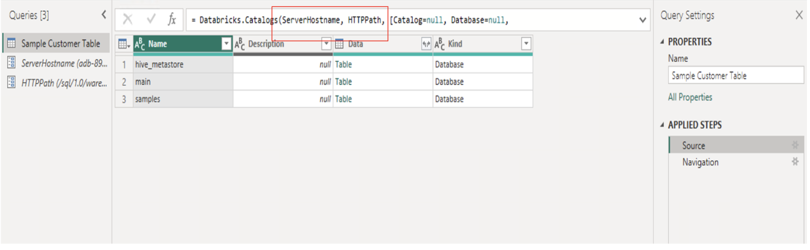

# Connecting Power BI to Databricks SQL Using Parameters

## Introduction
There are instances when data analysts have to connect to different Databricks SQL environments or a different Databricks SQL instances. This can be a lot of manual work and can often lead to errors. This guide explains how we can simplify the process of connecting to different Databricks SQL Warehouses by using parameters in Power BI. Utilizing parameters allows for flexibility when connecting to different Databricks workspaces or connecting to a different Databricks SQL warehouses. To create a parametrized report you can follow the steps mentioned in the [Step by Step Instructions](#step-by-step-instructions) section.

## Pre-requisites

Before you begin, ensure you have the following:

- [Databricks account](https://databricks.com/) and access to a Databricks workspace and also have DBSQL warehouse set up 
- [Power BI Desktop](https://powerbi.microsoft.com/desktop/) installed on your machine.

## Step by Step Instructions

### 1. Databricks Connection Parameter

1. Open Power BI Desktop.
2. Go to **"Home"** > "**Manage Parameters**".
3. Click on **"New"** to create a new parameter named `ServerHostname`.
4. Set the data type to "**Any"**.
5. Enter the default value as the **Server hostname** captured from the Databricks SQL Warehouse connection detail .

Repeat the above process and create parameter for HTTP path from SQL warehouse. You can get the HTTP path from DBSQL Warehouse connection details. Below is a sample screenshot of Databricks SQL Warehouse connection details showing the **Server hostname** and **HTTP path**:

Your parameters should look like below in Power BI:

s

### 2. Data Source Connection

1. Go to **"Home"**> **"Get Data"** > **"More..."**
2. Search for **"Databricks"** and select **"Azure Databricks"** (or **"Databricks"** when using Databricks on AWS or GCP).
3. Enter the following values:
   - **Server Hostname**: Enter the Server hostname value copied from Databricks SQL Warehouse connection details tab.
   - **HTTP Path**: Enter the HTTP path value copied from Databricks SQL Warehouse connection details tab.

### 3. Add parameters to M Query
1. Go to **"Transform Data"** > **Open Query Editor** > Under Query Setting Click on **Source**.
2. In the M Query under **Databricks.Catalog** replace hardcoded Hostname and HTTP Path values with the parameter names created in Step 1:

## Power BI Template 

To automate the process and ease the deployment process save the report as Power BI template. A sample Power BI template [DBSQL-Parameterized-Connection.pbit](DBSQL-Parameterized-Connection.pbit) is already present in the current folder pointing to **customer** table in **samples** catalog. When you open the template enter respective **ServerHostname** and **HTTP Path** values of your Databricks SQL warehouse, a default report poiniting to **customer** table in **samples** catalog is created. You can then add your respective catalog and tables and create report.

