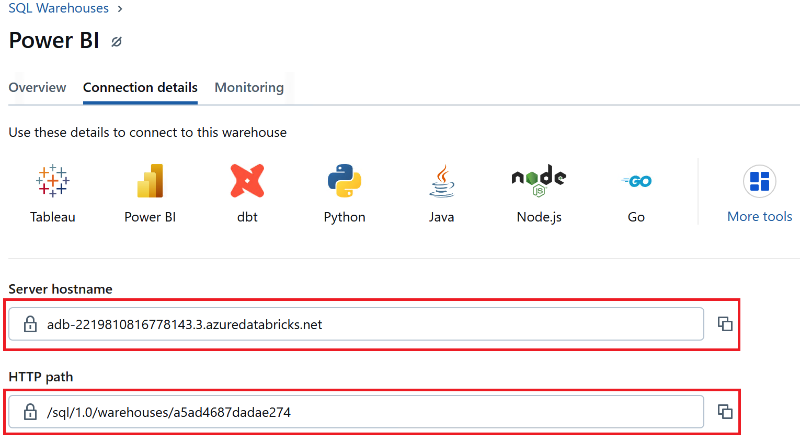
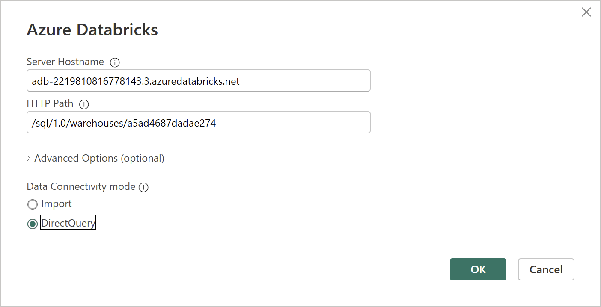
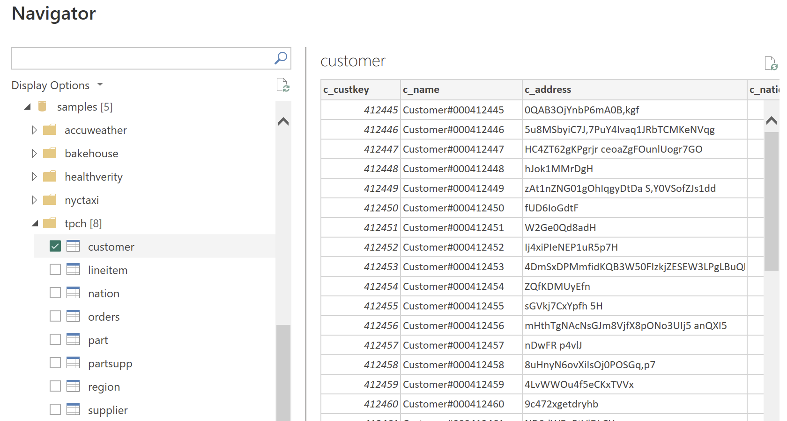
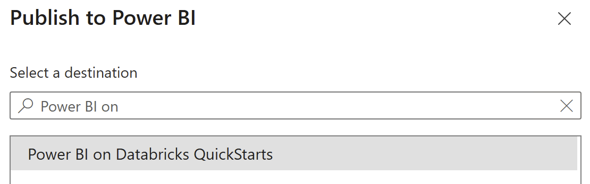
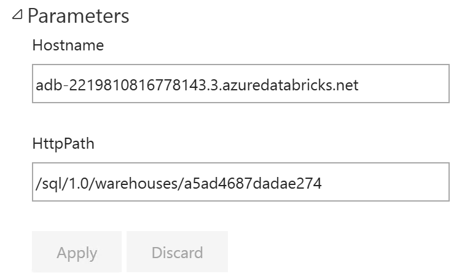

# Connection Parameters for Databricks connections

## Introduction
Switching between Databricks SQL Warehouses or even Databricks workspaces can be a time-consuming and error-prone process for Power BI developers and administrators. This repository provides a streamlined approach to managing these connections by leveraging Power BI parameters. By using parameters, you can easily and flexibly connect to various Databricks workspaces and SQL Warehouses without repetitive manual configuration.

This guide will walk you through how to set up and use parameters in Power BI for Databricks connections. To get started with creating a parameterized report, please refer to the [Step by step walkthrough](#step-by-step-walkthrough) section.

## Prerequisites

Before you begin, ensure you have the following:

- [Databricks account](https://databricks.com/), access to a Databricks workspace, Unity Catalog, and SQL Warehouse
- [Power BI Desktop](https://powerbi.microsoft.com/desktop/), latest version is highly recommended
- [Power BI](https://powerbi.com) workspace


## Step by step walkthrough

### 1. Connect to Databricks data

1. Open Databricks workspace in a browser.
2. Open **SQL Warhouses** → select your SQL Warehouse → **Connection details**.
3. Note **Server hostname** and **HTTP path** values. We will use these values later on.

   

4. Open Power BI Desktop. Create a Blank report.
5. Click **Home** → **Get data** → **More** → Search for **Databricks** and select **Azure Databricks** (or **Databricks** when using Databricks on AWS or GCP).
6. Paste the values of **Server hostname** and **HTTP Path** previously noted.

   

7. Choose any Data Connectivity mode - either **Import** or **DirectQuery**.
8. Click **OK**. If prompted, enter authentication details.
9. Search for **samples** catalog, **tpch** schema, **customer** table.

   

10. Select it and click **Load**.


### 2. Create parameters

1. Click **Home** → **Transform data** → **Manage Parameters**.
2. Click **New** to create a new parameter. Use the following properties:
   - Name - `Hostname`
   - Required - `No`
   - Type - `Text`
   - Current Value - `Server hostname of your SQL Warehouse`
3. Click **New** to create a new parameter. Use the following properties:
   - Name - `HttpPath`
   - Required - `No`
   - Type - `Text`
   - Current Value - `HTTP path of your SQL Warehouse`

      
4. Click **OK**.


### 3. Add parameters to M-query

1. Select **customer** → click **Advanced Editor**.
2. Change the code as shown below.
   - Before:
   ```
   Source = Databricks.Catalogs("adb-2219810816778143.3.azuredatabricks.net", "/sql/1.0/warehouses/a5ad4687dadae274", [Catalog=null, Database=null, EnableAutomaticProxyDiscovery=null]),
   ```
   - After:
   ```
   Source = Databricks.Catalogs(Hostname, HttpPath, [Catalog=null, Database=null, EnableAutomaticProxyDiscovery=null]),
   ```
3. Click **Done** → **Close & Apply**.
4. Save the file.


### 4. Validate in Power BI Service

1. Click **Publish** → choose Power BI workspace to which you would like to publish the report.

   

2. Once publish is complete, open Power BI workspace in a web browser.
3. Open the settings of published semantic model → expand **Parameters**.

4. Now you can easily change the values of **Hostname** and **HttpPath** parameters without the need for changing these values in Power BI Desktop and republishing the semantic model.

   

> [!TIP]
> You can parameterize not only SQL Warehouse connectivity information but any string/number/datetime literals in your M-code. E.g., the names of **Catalog** and **Schema**.

### 5. Power BI Template 
1. Switch to Power BI Desktop.
2. Click **File** → **Save as** → choose path → Save as type **Power BI template files (*.pbit)**
3. When prompted, optionally add template description. Click **OK**.

> Now you can use this template to create new report with the same structure. However, Power BI Desktop will prompt for parameter values. Therefore, you can build the same report using a different Databricks workspace or SQL Warehouse.


## Conclusion

Using parameters in Power BI when connecting to Databricks SQL offers significant benefits by simplifying and streamlining the process of managing connections to different Databricks workspaces and SQL Warehouses. Instead of manually updating connection details each time you need to switch environments - a process prone to errors and inefficiency - parameters enable you to define key connection attributes like the server hostname and HTTP path as configurable values. This not only makes the workflow more flexible and efficient, but also reduces the chances of mistakes. With parameters, you can easily change connections directly within Power BI Service or when reusing a template, allowing for quicker report deployment and adaptability across various projects and teams.


## Power BI Template 

A Power BI template [Connection Parameters.pbit](./Connection%20Parameters.pbit) is present in this folder as a reference implementation. To use the template, simply enter your Databricks SQL Warehouse's **`Hostname`** and **`HttpPath`** that correspond to the environment set up in the instructions above. The template uses **`samples`** catalog, therefore you don't need to prepare any additional dataset.