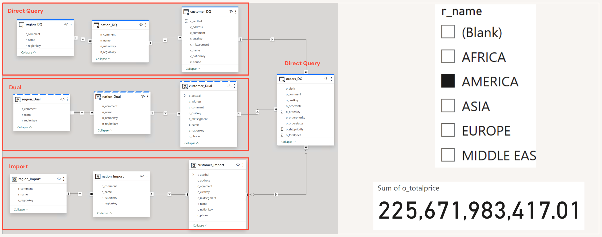
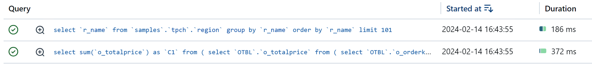
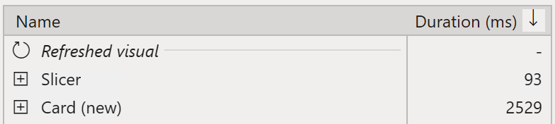
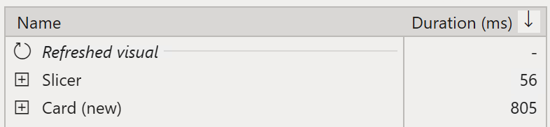

# Using storage modes - Direct Query vs Dual vs Import

## Introduction
Power BI provides 3 different storage modes - **Import**, **Direct Query**, and **Dual**. When using Databrics Lakehouse, **Direct Query** mode is a great choice because it provides an ability to query huge amounts of data which can exceed **Import** mode capacity in order of magnitude. However, obviously **Direct Query** mode comes with extra query latency compared to **Import** mode.

There is a best practice on chosing storage modes in Power BI described by Phil Seamark in his blog post [Power BI Storage Modes for Aggregations](!https://dax.tips/2021/10/11/power-bi-storage-modes-for-aggregations/) which is unfortunately often not followed.

In this sample we will consider practical aspects of chosing different storage modes in Power BI model.

## Pre-requisites
1. Databricks workspace.
2. Databricks SQL Warehouse, Small cluster size.
3. Power BI Desktop, latest version is recommended.

## Step by Step Walkthrough
### Report Design
Our report is based on **samples** catalog, **tpch** schema. It uses **orders** as fact table in **Direct Query** mode and **region**, **nation**, and **customer** as dimension tables in different modes.
The report visuals include a filter on **region** table and a card displaying aggregation of **o_totalprice** column in **orders** fact table.

### Direct Query mode
First, let's explore the behavior of Power BI when dimension tables are set to **Direct Query** mode.
In Performance Analyzer after refreshing visuals we can see that refreshing both visuals (the Filter and the Card) took roughly 1 second.

In Databricks SQL Query History expectedly we can see 2 SQL-queries. The first query retrieved records for the Filter visual, i.e. from **region** table. The second query retrieved the records to render the Card visual, i.e. from **orders** table.

In the second query profile we can see that it returned only 1 record.

### Import mode
In the previous section we saw the report performance when using Direct Query mode for dimension tables. It looked quite good. However, on larger datasets a Power BI developer may decide to optimize the model and set dimension tables to **Import** mode. So Power BI will serve dimension tables from in-memory cache which should boost performance.
Let's now explore the behavior of Power BI when dimension tables are set to **Import** mode.
In Performance Analyzer after refreshing visuals we can see that refreshing the Filter visual is now much faster (less than 100ms), however refreshing the Card visual took much longer, i.e. over 2.5 seconds!!!

In Databricks SQL Query History expectedly we can see only 1 SQL-query. This query retrieves the records to render the Card visual, i.e. from **orders** table. It's pretty fast, i.e. less than 200ms.

However, in the query profile we can see that it returned almost 500,000 records. This obviously cause extra network latency and processing on Power BI end. This is the reason why refreshing the Card visual took longer than 2.5 seconds.

As we can see here, instead of performance boost we actually get performance decline with this "optimization".

### Dual mode
Let's now explore the behavior of Power BI when dimension tables are set to **Dual** mode.
In Performance Analyzer after refreshing visuals we can see that refreshing the Filter visual is still very fast (less than 100ms). And refreshing the Card visual is now also pretty fast, i.e. ~800ms.

In Databricks SQL Query History we can see only 1 SQL-query. This query retrieves the records to render the Card visual, i.e. from **orders** table. 

And in the query profile we can see that it returned only 1 record. Hence, the processing on Power BI end was very efficient. 

## Conclusion
As we saw in this example, though when using **Import** mode data is stored in in-memory cache, it is not a silver bullet for performance optimizations. When working with large data volumes we recommend using storage modes as per the following recommendations.

Table function	| Recommended Storage Mode
| ------------- | ------ |
Large Fact Table | **Direct Query**
Dimension Tables | **Dual** (not Import!!)
Aggregation Table | Import (or Direct Query)

By following these recommendations you can ensure the best possible user experience and minimize the workload on Power BI and Databricks SQL.
Please note that switching storage mode to Import is irreversible operation. Therefore, we strongly recommend creating a backup of your reports before switching tables to **Import** modef for experimentation purposes.

## Power BI Template 
A sample Power BI template [DirectQuery-Dual-Import.pbit](DirectQuery-Dual-Import.pbit) is present in the current folder. When opening the template, enter respective **ServerHostname** and **HTTP Path** values of your Databricks SQL Warehouse. The template uses **samples** catalog, therefore you don't need to prepare any additional data for this report.
