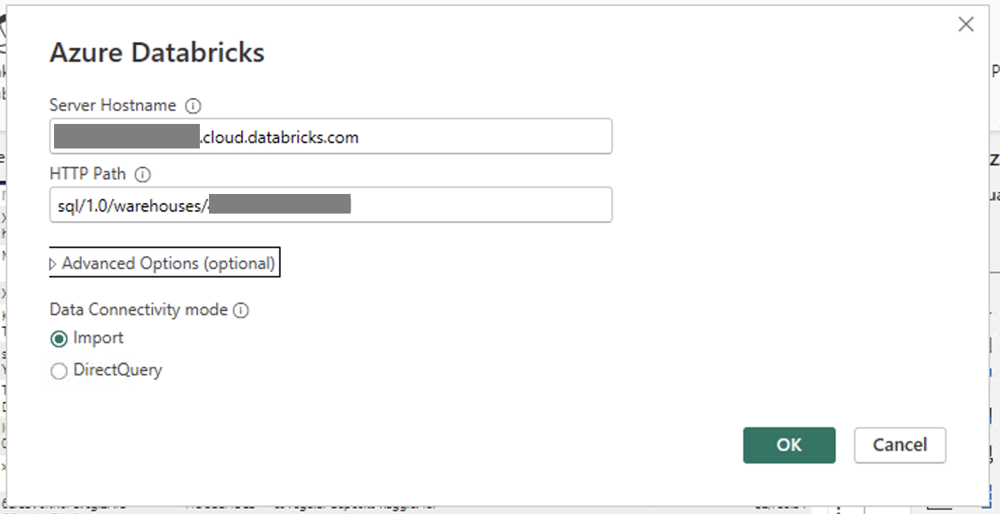

# Using storage modes - DirectQuery vs Dual vs Import

## Introduction
[Storage Modes](https://learn.microsoft.com/en-us/power-bi/transform-model/desktop-storage-mode) are really important aspect of Power BI. Whether you're a seasoned Power BI user or just getting started, understanding storage modes is crucial for maximizing performance and efficiently managing your data. This readme file serves as your roadmap, providing insights into the various storage modes offered by Power BI. In this example we will showcase and compare performance between Direct Query, Import, and Dual storage modes and show how Dual helps with performance of the report. You can follow the steps mentioned in the [Step by Step Instructions](#step-by-step-instructions) section.

## Pre-requisites

Before you begin, ensure you have the following:

- [Databricks account](https://databricks.com/) and SQL warehouse set up 
- [Power BI Desktop](https://powerbi.microsoft.com/desktop/) installed on your machine.

## Step by Step Instructions

## 1. Databricks Data Source Connection 

1. Open Power BI Desktop
2. Go to **"Home"** > **"Get Data"** > **"More..."**
3. Search for **"Databricks"** and select **"Azure Databricks"** (or **"Databricks"** when using Databricks on AWS or GCP).
4. Enter the following values:
   - **Server Hostname**: Enter the Server hostname value from Databricks SQL Warehouse connection details tab.
   - **HTTP Path**: Enter the HTTP path value  from Databricks SQL Warehouse connection details tab.

Below is the sample screenshot of how the data source would look like

## Best Practice 
It is always a good practice to parameterize your connection string. This really helps ease out the development expeience as you can dynamically connect to any Databricks SQL warehouse. For details on how to paramterize your connection string you can refer to [this](/01.%20Connecting%20Power%20BI%20to%20Databricks%20SQL%20using%20Parameters) article.

## 2. Performance with different storage modes for dimension table
In the next section we will compare different storage modes and showcase which storage mode is good for dimension table. There are two common query patterns for dimension tables:
1. Retrieving values for slicers/filters.
2. Aggregation on fact tables using dimension data.

For our testing scenario we are using a "**Small**" Pro SQL Warehouse and we will create report with both query pattterns highlighted above. 

### 2.1. Data Model Creation
To make performance testing easy to follow we will use **samples** catalog and **tpch** schema and use below tables. In order to compare the performance between three modes we will use dimension tables with different storage modes and analyze time taken based on each mode.

1. **region_DQ** - *region* dimension table configured to use **Direct Query** storage mode.

2. **nation_DQ** - nation dimension table configured to use **Direct Query** storage mode.

3. **customer_DQ** - customer dimesntion table configured to use **Direct Query** storage mode.

4. **region_Dual** - region dimension table configured to use **Dual** storage mode. 

5. **nation_Dual** - nation dimension table configured to use **Dual** storage mode.

6. **customer_Dual** - customer dimesntion table configured to use **Dual** storage mode.

7. **region_Import** - region dimension table configured to use **Import** storage mode. 

8. **nation_Import** - nation dimension table configured to use **Import** storage mode.

9. **customer_Import** - customer dimesntion table configured to use **Import** storage mode.

10. **orders_DQ** - orders fact table configured to use **Direct Query** storage mode.

Below is the screenshot of how our data model and the report with 2 dimension scenario's mentioned above looks like:

### 2.2. Direct Query mode 
In order to get best results it's better to run the test against already started SQL Warehouse by running few samples queries against it. After warehouse is warmed up follow below steps:
1. Click **Optimize** > **Performance Analyzer** in Power BI Desktop.
2. In the Performance Analyzer tab click "**Start Recording**".
3. Open **DirectQuery** report page and change the region in the respective filter visual.
   
#### 2.2.1 Query analysis: Performance Analyzer and DBSQL
As shown on the screenshot of the Performance Analyzer below the query took **953 ms** for the flicer and **946 ms** for the card visual.  

You can also find the query execution time by looking at query history in Databricks SQL. Since both the dimension and fact tables are set to Direct Query mode, Filter Card visuals fired 2 queries in the backend. Also the I/O stats show 1 row returned for the Card visual query.

### 2.2 Import mode 
1. Click **Optimize**>**Performance Analyzer** in Power BI desktop.
2. In the Performance Analyzer tab click "**Start Recording**".
3. Open **Import** report page and change the region in the respective filter visual.
   
#### 2.2.1 Query analysis: Performance Analyzer and DBSQL
As shown on the screenshot of the Performance Analyzer below the query for Slicer visual took only **93 ms** as the dimension table is set to Import method. However, it took **2529 ms** for the Card visual query

You can also find the query execution time by looking at query history in Databricks SQL. Since the dimension table is set to Import mode the Filter visual did not fire a query Databricks SQL. Because the fact table is set to Direct Query mode the Card visual fired 1 query in the backend.  

As I/O stats shows, in this method **~500k** rows are returned. This resultset is then processed on Power BI end. This is the reason why Direct Query mode is faster than Import mode in this case. 

### 2.3 Dual mode 
1. Click **Optimize**>**Performance Analyzer** in Power BI desktop.
2. In the Performance Analyzer tab click "**Start Recording**".
3. Open **Dual** report page and change the region in the respective filter visual.
   
#### 2.3.1 Query analysis: Performance Analyzer and DBSQL 

As shown on the screenshot of the Performance Analyzer below the Slicer visual query took only **56 ms** and Card visual query took **805 ms**. 

You can also find the query execution time by looking at query history in Databricks SQL. As Dual mode combines  Import and Direct Query modes, Power BI intelligently decides when to use which approach. In this case there was no query fired in Databricks SQL for Filter visual. However, there was a query fired for Card visual.

As I/O stats shows, in this case only **1** row was returned because the value from Filter visual was passed to the query of Card visual. Thus Card visual query was much more efficient, hence faster.

## Conclusion
As we could see above using **Import** storage mode to improve performance of Power BI semantic models does not always lead to positive outcomes. In certain cases it can actually decrease performance. Below you can see our general recommendation for using different storage modes for typical star schema data models.

By following these recommendations you can ensure the best possible user experience and minimize the workload on Power BI and Databricks SQL. Please note that switching storage mode to Import is irreversible operation. Therefore, we strongly recommend creating a backup of your reports before switching tables to Import mode for experimentation purposes.

## Power BI Template 
To automate the process and ease the deployment process save the report as Power BI template. A sample Power BI template [DirectQuery-Dual-Import.pbit](./DirectQuery-Dual-Import.pbit) is already present in the current folder pointing to  **samples** catalog and **tpch** tables. When you open the template enter respective **ServerHostname** and **HTTP Path** values of your Databricks SQL warehouse. The template will contain three report pages using Direct Query, Import, and Dual storage modes for dimension tables. You can then follow secion 2.2 and 2.3 above to compare behaviour and performance. 
