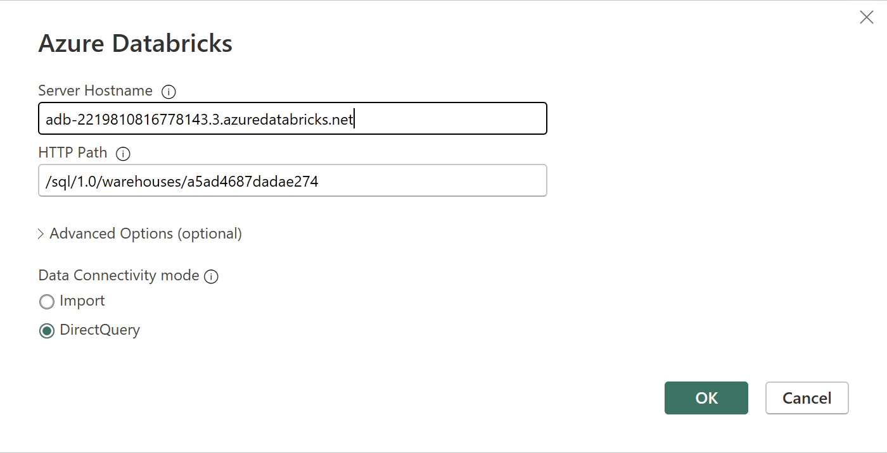
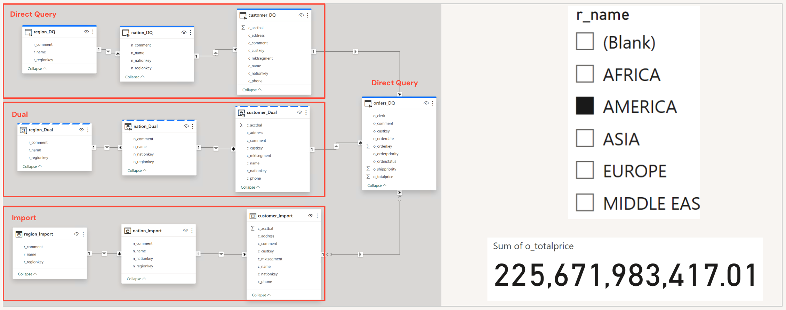
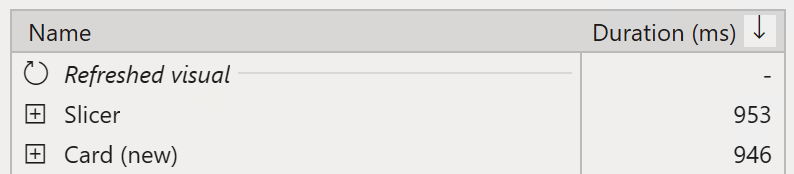
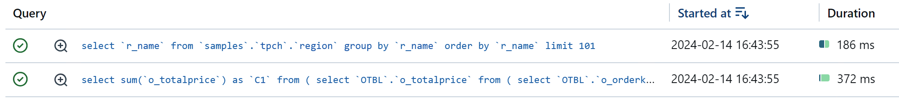
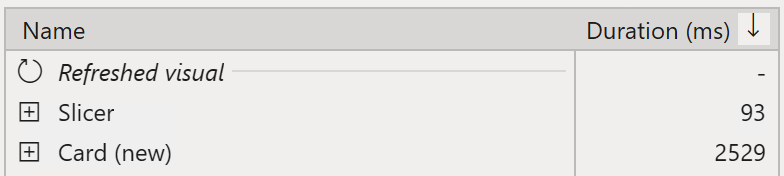
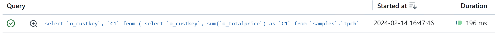
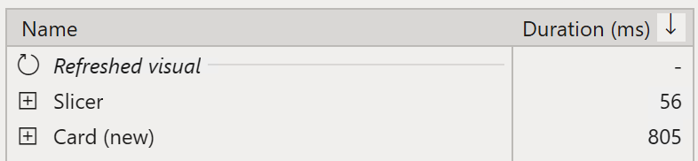
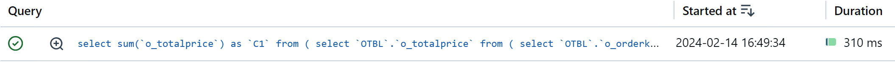
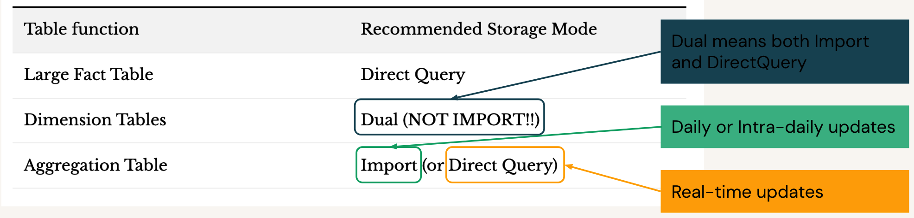

# Storage modes - DirectQuery vs Dual vs Import

## Introduction

[Storage modes](https://learn.microsoft.com/en-us/power-bi/transform-model/desktop-storage-mode) are a critical component of Power BI data modeling. Whether you’re a seasoned practitioner or just getting started, grasping how storage modes work is key to optimizing report performance and managing data efficiently. This quickstart will help you navigate the different storage modes available in Power BI - _DirectQuery_, _Import_, and _Dual_ - and explains how each option impacts performance and user experience. Through practical examples, you’ll see side-by-side comparisons and learn how leveraging _Dual_ storage mode can significantly enhance report responsiveness. To get started, follow the detailed instructions in the [Step by step walkthrough](#step-by-step-walkthrough) section.

## Prerequisites

Before you begin, ensure you have the following:

- [Databricks account](https://databricks.com/), access to a Databricks workspace, Unity Catalog, and SQL Warehouse
- [Power BI Desktop](https://powerbi.microsoft.com/desktop/), latest version is highly recommended

## Step by step walkthrough

In the next section we will compare different storage modes and showcase which storage mode is a good fit for dimension table. There are two common query patterns for dimension tables:
1. Retrieving values for slicers/filters.
2. Aggregation on fact tables using dimension data.

For our testing scenario we use a **Small** Pro SQL Warehouse. We will create report with both query pattterns highlighted above. 

### 1. Data Model

1. Open Power BI Desktop → **"Home"** → **"Get Data"** → **"More..."**.

2. Search for **Databricks** and select **Azure Databricks** (or **Databricks** when using Databricks on AWS or GCP).

3. Enter the following values:
   - **Server Hostname**: Enter the Server hostname value from Databricks SQL Warehouse connection details tab.
   - **HTTP Path**: Enter the HTTP path value  from Databricks SQL Warehouse connection details tab.

   

> [!TIP]
> We recommend parameterizing your connections. This really helps ease out the Power BI development and administration expeience as you can easily switch between different environments, i.e., Databricks Workspaces and SQL Warehouses. For details on how to paramterize your connection string, you can refer to [Connection Parameters](/01.%20Connection%20Parameters/) article.

4. Connect to **`samples`** catalog, **`tpch`** schema.

5. Add tables as follows.
   - **`region_DQ`** - *region* dimension table set to **DirectQuery** storage mode.
   - **`nation_DQ`** - *nation* dimension table set to **DirectQuery** storage mode.
   - **`customer_DQ`** - *customer* dimension table set to **DirectQuery** storage mode.
   - **`region_Dual`** - *region* dimension table set to **Dual** storage mode. 
   - **`nation_Dual`** - *nation* dimension table set toset **Dual** storage mode.
   - **`customer_Dual`** - *customer* dimesntion table set to **Dual** storage mode.
   - **`region_Import`** - *region* dimension table set to use **Import** storage mode. 
   - **`nation_Import`** - *nation* dimension table set to **Import** storage mode.
   - **`customer_Import`** - *customer* dimension table set to **Import** storage mode.
   - **`orders_DQ`** - *orders* fact table set to **DirectQuery** storage mode.

> [!TIP]
> First, add fact table and the first set of dimension tables using *DirectQuery* mode. Then, replicate and rename dimension tables by using *Duplicate* capability. Once all tables are added, set desired storage mode in *Model view*.

> [!WARNING]
> Switching storage mode to *Import* is irreversible operation. Therefore, we strongly recommend creating a backup of your reports before switching tables to *Import* mode for experimentation purposes.

6. Create table relationships as follows.
   - **`region_DQ`** → **`nation_DQ`** → **`customer_DQ`** → **`orders_DQ`**
   - **`region_Import`** → **`nation_Import`** → **`customer_Import`** → **`orders_DQ`**
   - **`region_Dual`** → **`nation_Dual`** → **`customer_Dual`** → **`orders_DQ`**

7. Create 3 report pages for 3 storage modes. Each page should contain a Card visual displaying **`Sum of o_totalprice`** and a Filter displaying **`r_name`** column.
   - **DirectQuery** page - use **`r_name`** column from **`region_DQ`** table
   - **Import** page - use **`r_name`** column from **`region_Import`** table
   - **Dual** page - use **`r_name`** column from **`region_Dual`** table.

Below is the screenshot demonstrating the resulting data model and the report.

### 2. DirectQuery 
> [!Note]
> In order to get similar results we recommend running the test on a SQL Warehouse which is already started.

1. In Power BI Desktop, click **Optimize** → **Performance Analyzer**.
2. In the Performance Analyzer tab, click **Start Recording**.
3. Open **DirectQuery** report page and change the region in the respective Filter visual.

As shown on the screenshot of the Performance Analyzer below, in our environment the query took **953 ms** for the slicer and **946 ms** for the card visual.

You can also find the query execution time by looking at Databricks Query History. Since both the dimension and fact tables are set to *DirectQuery* mode, the Filter and the Card visuals fired 2 queries in the backend. 

Also the I/O stats show 1 row returned for the Card visual query.

### 3. Import 
1. In Power BI Desktop, click **Optimize** → **Performance Analyzer**.
2. In the Performance Analyzer tab, click **Start Recording**.
3. Open **Import** report page and change the region in the respective Filter visual.

As shown on the screenshot of the Performance Analyzer below, the query for the Slicer visual took only **93 ms** as the dimension table is set to *Import* method. However, it took **2529 ms** for the Card visual query. This is much slower than in the previous setup where we used *DirectQuery* mode for both fact and dimension tables.

You can also find the query execution time by looking at Databricks Query History. Since the dimension table is set to *Import* mode the Filter visual did not fire a query. Because the fact table is set to *DirectQuery* mode the Card visual fired 1 query.  

As I/O stats shows, in this setup almost **500k** rows are returned. This resultset is then processed on Power BI end. This is the reason why using *DirectQuery* mode for dimension tables results in faster performance than using *Import* mode in this case. 

### 4. Dual
1. In Power BI Desktop, click **Optimize** → **Performance Analyzer**.
2. In the Performance Analyzer tab, click **Start Recording**.
3. Open **Dual** report page and change the region in the respective Filter visual.

As shown on the screenshot of the Performance Analyzer below the Slicer visual query took only **56 ms** and Card visual query took **805 ms**.

You can also find the query execution time by looking at Databricks Query History. When using *Dual* mode, Power BI provides the benefits of both *Import* and *DirectQuery* modes by intelligently deciding when to use which approach. In this case, there was no query fired in Databricks SQL for the Filter visual. However, there was a query fired for the Card visual.

As I/O stats shows, in this case only **1** row was returned because the value from the Filter visual was passed to the query of the Card visual. Thus, the Card visual query was much more efficient, hence faster.

## Conclusion

As we could see above using **Import** storage mode to improve performance of Power BI semantic models does not always lead to positive outcomes. In certain cases it can actually decrease performance. Below you can see our general recommendation for using different storage modes for typical star schema data models.

Using **Dual** mode for dimension tables in Power BI offers key benefits over Import mode, especially when working with DirectQuery fact tables. **Dual** mode enables Power BI to intelligently switch between *Import* and *DirectQuery* behaviors based on the visual and context: simple slicers or filters can leverage fast, cached data (like Import mode), resulting in very quick response times; meanwhile, aggregations or visuals involving the fact table can operate in *DirectQuery* mode, ensuring only the necessary data is queried from the source. In practice, this reduces unnecessary large data transfers - unlike Import mode, which can force Power BI to retrieve and process entire datasets on the client side, often leading to slower performance and heavier workload. By using **Dual** mode, reports achieve both the efficiency of in-memory querying for dimension-only visuals and the accuracy and freshness of *DirectQuery* for interactions with large fact tables, ultimately resulting in faster query times, reduced backend workload, and a much smoother end-user experience.

## Power BI Template 

A Power BI template [Storage Modes.pbit](./Storage%20Modes.pbit) is present in this folder to demonstrate the difference in Power BI behaviour when using *Import*, *DirectQuery*, and *Dual* storage modes outlined above. To use the template, simply enter your Databricks SQL Warehouse's **`ServerHostname`** and **`HttpPath`** that correspond to the environment set up in the instructions above. The template uses **`samples`** catalog, therefore you don't need to prepare any additional dataset.