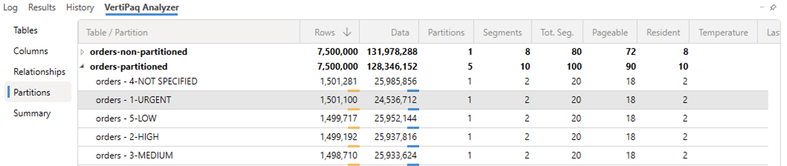
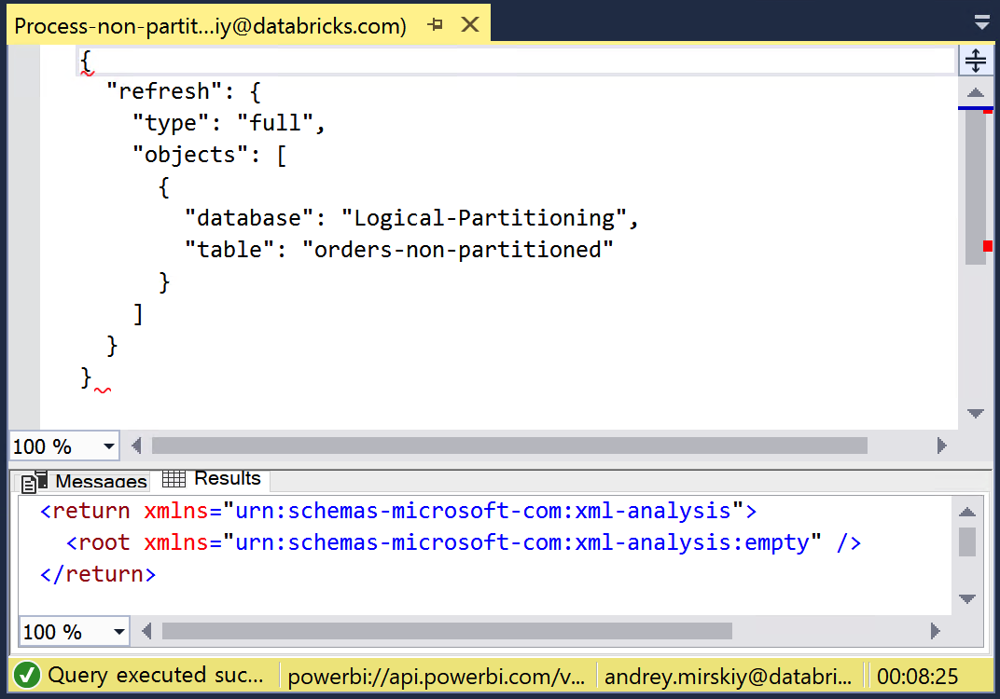
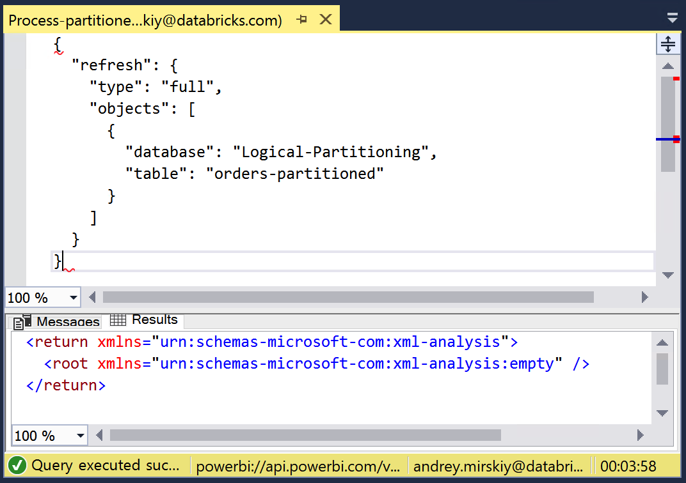

# Logical Partitioning

## Introduction

[Logical Partitioning](https://learn.microsoft.com/en-us/analysis-services/tabular-models/create-and-manage-tabular-model-partitions?view=asallproducts-allversions) is a powerful feature that enables you to divide large tables into logical segments, allowing each partition to be refreshed independently. This can dramatically improve the refresh performance of your Power BI semantic models by enabling parallel processing of multiple partitions. In this quickstart, we'll demonstrate how Logical Partitioning can accelerate data refresh times and show you how to implement it step by step. For detailed instructions, refer to the [Step by step walkthrough](#step-by-step-walkthrough) section.

> [!NOTE]
> We use the term **Logical Partitioning** to distinguish from [Delta partitioning](https://docs.databricks.com/gcp/en/tables/partitions). By Logical Partitioning, we assume splitting tables into logical segments within **Power BI semantic models**.

## Prerequisites

Before you begin, ensure you have the following:

- [Databricks account](https://databricks.com/), access to a Databricks workspace, Unity Catalog, and Databricks SQL Warehouse
- [Power BI Desktop](https://powerbi.microsoft.com/desktop/), latest version is highly recommended
- [Power BI](https://powerbi.com) **Premium** workspace
- [Tabular Editor](https://tabulareditor.com/), free version is sufficient
- [DAX Studio](https://daxstudio.org/)
- [SQL Server Management Studio](https://aka.ms/ssmsfullsetup)

  

## Step by step walkthrough

1. Open Power BI Desktop → **"Home"** → **"Get Data"** → **"More..."**.

2. Search for **Databricks** and select **Azure Databricks** (or **Databricks** when using Databricks on AWS or GCP).

3. Enter the following values:
   - **Server Hostname**: Enter the Server hostname value from Databricks SQL Warehouse connection details tab.
   - **HTTP Path**: Enter the HTTP path value  from Databricks SQL Warehouse connection details tab.

> [!TIP]
> We recommend parameterizing your connections. This really helps ease out the Power BI development and administration expeience as you can easily switch between different environments, i.e., Databricks Workspaces and SQL Warehouses. For details on how to paramterize your connection string, you can refer to [Connection Parameters](/01.%20Connection%20Parameters/) article.

4. Connect to **`samples`** catalog, **`tpch`** schema.

5. Add table **`orders`**, set it to **Import** mode.

6. Publish this report to a **Premium** workspace.

7. Connect to XMLA-endpoint of the published semantic model using [SQL Server Management Studio](https://aka.ms/ssmsfullsetup) and create a non-partitioned version of **`orders`** table - **`orders-non-partitioned`** - by executing [Create-non-partitioned-table.xmla](./XMLA/Create-non-partitioned-table.xmla) script.
    As shown below, you can leverage [DAX Studio](https://daxstudio.org/) to ensure that the table consists of a single partition.
    

8. Create another version of **`orders`** table - **`orders-partitioned`** - using [Create-partitioned-table.xmla](./XMLA/Create-partitioned-table.xmla) script.
    Alternatively, you can use [Tabular Editor](https://tabulareditor.com/) to create partitions. [This video](https://www.youtube.com/watch?v=6CRqdsLjHNA) demonstrates how you can create parititons. In our example we have created these partitions based on the **o_priority** column which results in even data distribution. As shown below in DAX Studio screenshot, 5 parittions are created in **orders-partitioned** table, every partition contains ~1.5M records:
    

9. To demonstrate the benefits of partioning, we process  **`orders-non-partitioned`** table by executing [Process-non-partitioned-table.xmla](./XMLA/Process-non-partitioned-table.xmla) in [SQL Server Management Studio](https://aka.ms/ssmsfullsetup). As shown below, it took **8min 25sec**. 

    

10. Finally, we process **`orders-partitioned`** table by executing [Process-partitioned-table.xmla](./XMLA/Process-partitioned-table.xmla) XMLA-script. Whereas the processing of *parititioned* table took just under **4min** for the same total number of records. 

    

## Conclusion

When using **Import** mode, Logical partitioning in Power BI allows large tables to be divided into separate segments, with each partition able to be refreshed independently. This approach significantly improves data refresh performance because multiple partitions can be processed in parallel, reducing total refresh time compared to refreshing a single, monolithic table. As demonstrated, partitioning can cut refresh durations, making data updates much faster and more efficient, especially for large datasets. By leveraging logical partitioning, Power BI semantic models become more scalable, providing a better experience for both administrators and end users.

> [!IMPORTANT]
> Please note that actual performance improvement due to logical partitioning may vary, as it depends on multiple factors, such as number of columns, data types, data distribution, etc.

## Power BI Template 

A Power BI template [Logical Partitioning.pbit](./Logical%20Partitioning.pbit) is present in this folder to demonstrate the benefits of Logical Partitioning. To use the template, simply enter your Databricks SQL Warehouse's **`ServerHostname`** and **`HttpPath`** that correspond to the environment set up in the instructions above. The template uses **`samples`** catalog, therefore you don't need to prepare any additional dataset.