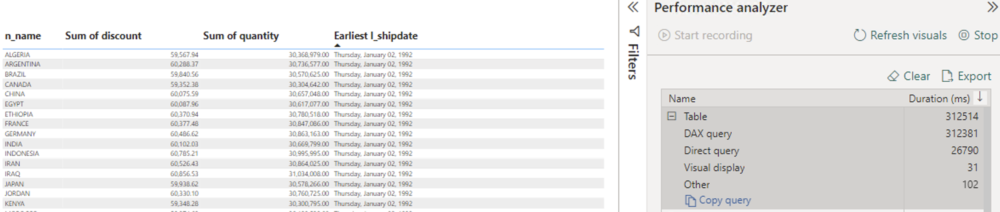
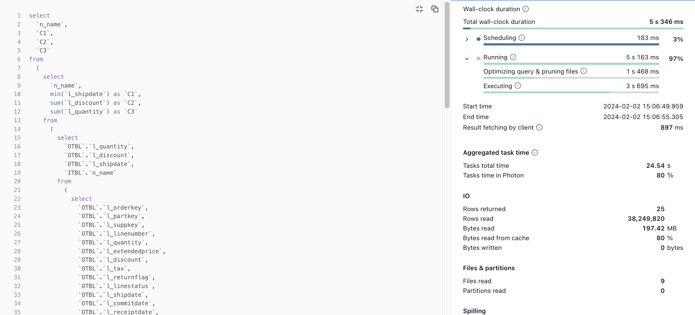
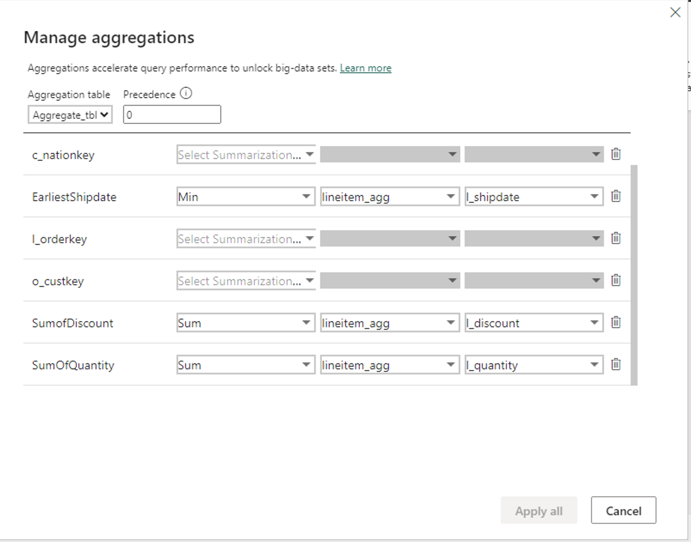

# Improving Performance of Power BI Reports using Aggregation Table

## Introduction
[Aggregation tables](https://learn.microsoft.com/en-us/power-bi/transform-model/aggregations-advanced) are the unsung heroes of Power BI, quietly optimizing performance and efficiency behind the scenes. In the dynamic world of data analysis, where speed and accuracy are paramount, these specialized tables play a crucial role in improving performance for large Power BI dataset in DirectQuery storage mode. This guide explains how we can set up Aggregation tables and also showcases how Aggregation Tables help improve perfromance over Power BI dataset. You can follow the steps mentioned in the [Step by Step Instructions](#step-by-step-instructions) section.

## Pre-requisites

Before you begin, ensure you have the following:

- [Databricks account](https://databricks.com/) and access to a Databricks workspace and also have DBSQL warehouse set up 
- [Power BI Desktop](https://powerbi.microsoft.com/desktop/) installed on your machine.

## Step by Step Instructions

## 1. Databricks Data Source Connection 

1. Open Power BI Desktop
2. Go to **"Home"**> **"Get Data"** > **"More..."**
3. Search for **"Databricks"** and select **"Azure Databricks"** (or **"Databricks"** when using Databricks on AWS or GCP).
4. Enter the following values:
   - **Server Hostname**: Enter the Server hostname value from Databricks SQL Warehouse connection details tab.
   - **HTTP Path**: Enter the HTTP path value  from Databricks SQL Warehouse connection details tab.

Below is the sample screenshot of how the data source would look like

## Best Practice 
It is always a good practice to parameterize your connection string. This really helps ease out the development expeience as you can dynamically connect to any DBSQL warehouse. For details on how to paramterize your connection string you can refer to [this](/01.%20Connecting%20Power%20BI%20to%20Databricks%20SQL%20using%20Parameters) article.

## 2. Showcasing Perfromance Improvement with Aggregate Table
In the next section we will showcase how aggregate table help improve performance of your Power BI report. We will do this by analyzing query performance of two similar reports one using Direct Query  and in the other we will create same report using Aggregate Table. For our testing scenario we are using a "**Small**" Pro cluster.
### 2.1 Data Model Creation
To make performance testing easy to follow we will use "Samples" catalog and "TPCH" schema and ingest below tables. We will also create a empty aggregate table by running the DDL script against "HMS" catalog and "Default" schema as we cannot write into "Samples" catalog.

1.Customer:Storage mode as Dual. Dimension table containing customer information and connected to nation dimension table using nationkey.

2.Nation: Storage mode as Dual. Dimension table containing nation name and details.

3.Orders: Storage mode as Direct Query. Fact table containing orders information and connected to customer dimension using customerkey.

4.LineItem: Storage mode as Direct Query. Fact table containing details like order shipment date , discount price etc. 

5.Orders_Agg: Storage mode as Direct Query.Copy of orders table and used for aggregate table report.

6.LineItem_Agg: Storage mode as Direct Query.Copy of lineitem table and used for aggregate table report.

7.Aggregate_Tbl: Storage mode as Direct Query.Run
[Data Source Connection](./Scripts/Aggregate_tbl_create) DDL script to create table in HMS. This table will be used to calculate aggregations we need for our aggegate table report. 

Below is the screen shot of how our star schema data model looks like

For details on different storage modes in Power BI  refer to [this](/02.%20DirectQuery-Dual-Import) article.

### 2.2 Direct Query Report 
In order to get best results it and avoid caching it's better to run the test against warm up warehouse by running few queries against warehouse. After warehouse is warmed up follow below steps :
1. Click **Optimize**>**Performance Analyzer** in Power BI desktop.
2. In the Performance Analyzer tab click "**Start Recording**".
3. Create a table visual with columns : Nation Name (From **Nation** table), Sum of discount,Sum of quantity and Earliest order ShipDate (From **LineItem** table).
4. Perfromance Analyzer tab will have a Table heading and a DAX query . Click on **Copy Query** . The DAX query should look similar to [this](/Scripts/Direct_Query1.dax) script.

Below is the screen shot of Direct Query Report : 

#### 2.2.1 Query Analysis : DAX Studio and DBSQl 
To compare the performance gains between Direct Query and Aggregate Table it is important to compare the query execution times .
1. Open **DAX Studio** and click Server Timings.
2. Open the [Direct_Query1.dax](./Scripts/Direct_Query1.dax) query stored under Scripts folder.
3. Click Run.

As shown in screenshot below the query takes **5.7 sec** 
You can also find the query execution time by looking at query history in DBSQL . As shown below the query took 5 sec and read **~38M** rows. 

### 2.3 Aggregate Table Report 
#### 2.3.1 Manage Aggregations 
The first step is to manage in-memory aggregations within Power BI in Aggregate_Tbl , created in Step 7 of section 2.1. This helps in query performance as aggregations are pre computed without needing to read the fact tables. In order to manage aggregations within PowerBI follow below steps :
1.Open **ModelView** in Power BI desktop.
2.Right Click "**Aggegate_Tbl**">"**Manage aggregations**.
3.Add the summarization,detail column and detail table as shown in below screenshot

#### 2.3.2 Create Aggregate Table visual report
1. Click **Optimize**>**Performance Analyzer** in Power BI desktop.
2. In the Performance Analyzer tab click "**Start Recording**".
3. Create a table visual with columns : Nation Name (From **Nation** table), Sum of discount,Sum of quantity and Earliest order ShipDate (From **LineItem_Agg** table).
4. Perfromance Analyzer tab will have a Table heading and a DAX query . Click on **Copy Query** . The DAX query should look similar to [this](./Scripts/Manged_agg_Table_1.dax) script.

Below is the screen shot of Direct Query Report : 

## Power BI Template 

To automate the process and ease the deployment process save the report as Power BI template. A sample Power BI template [DBSQL-Parameterized-Connection.pbit](DBSQL-Parameterized-Connection.pbit) is already present in the current folder pointing to **customer** table in **samples** catalog. When you open the template enter respective **ServerHostname** and **HTTP Path** values of your Databricks SQL warehouse, a default report poiniting to **customer** table in **samples** catalog is created. You can then add your respective catalog and tables and create report.

