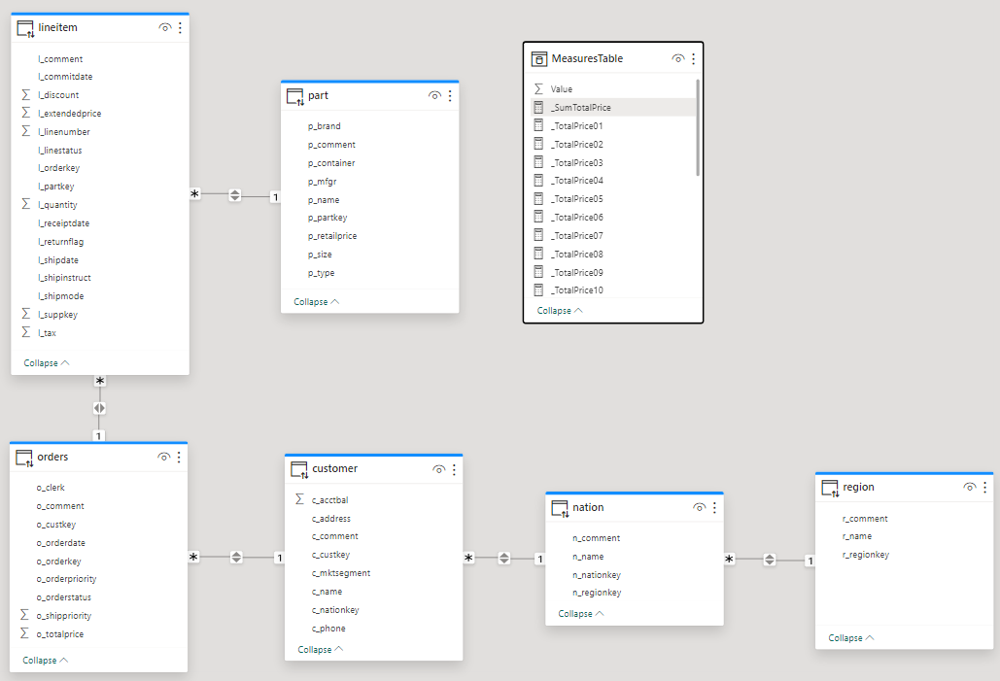
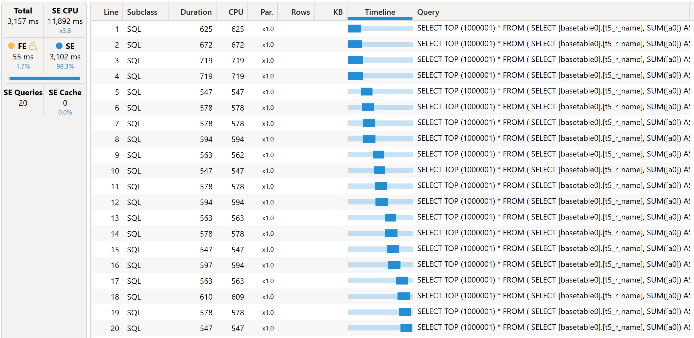
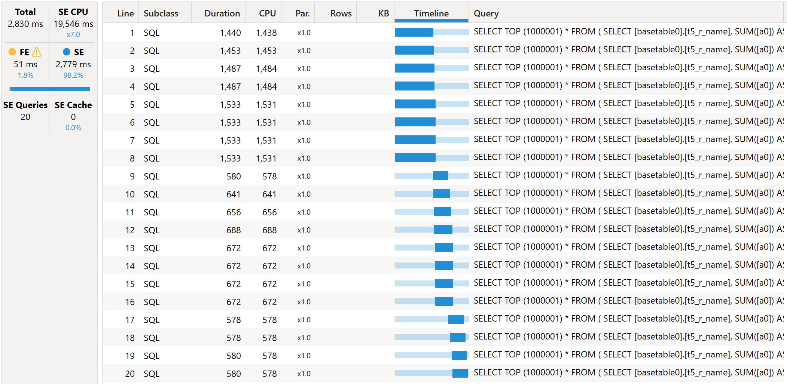
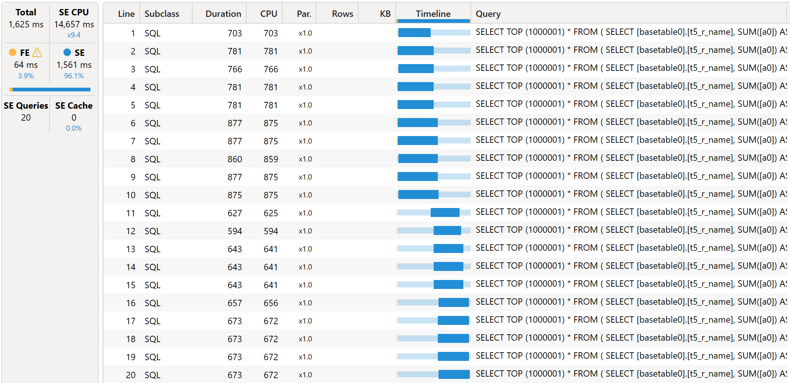
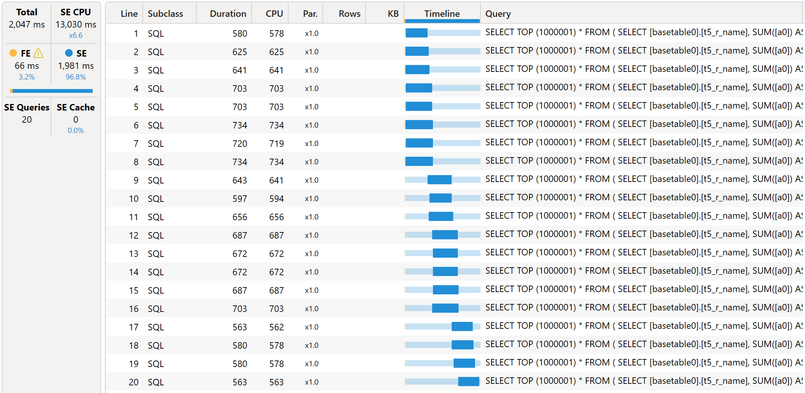
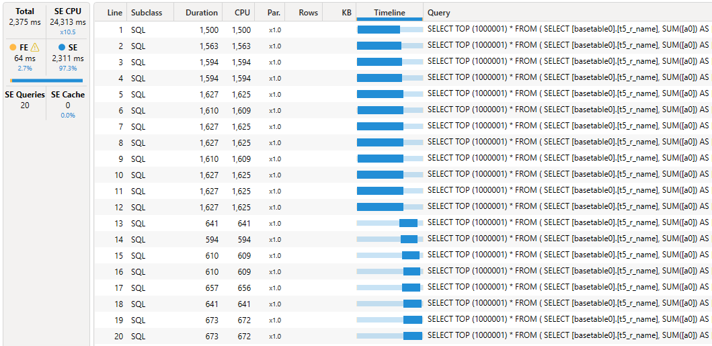
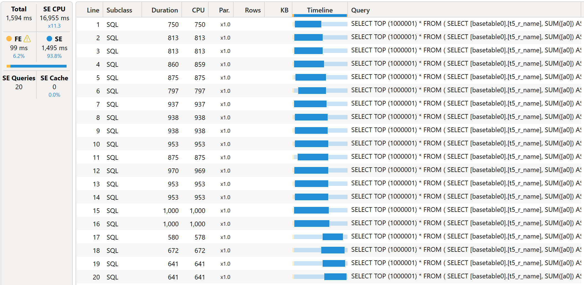
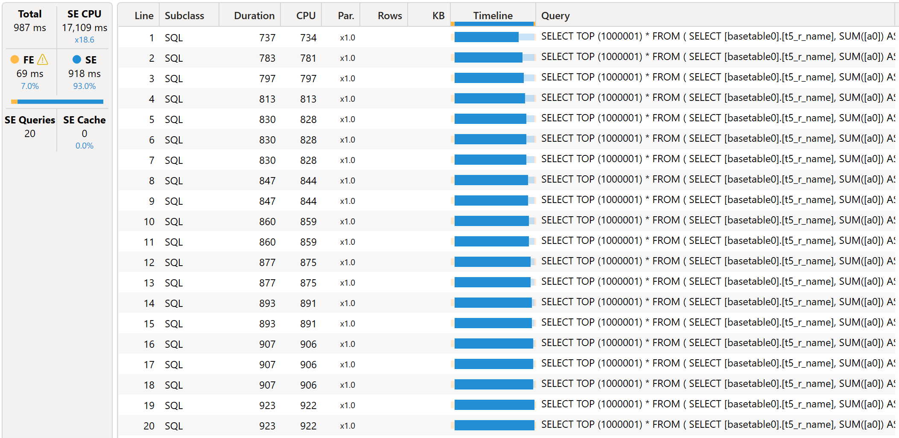

# Query Parallelization

## Introduction

One of the major advantages of integrating Power BI with Databricks Lakehouse is the ability to create reports that analyze massive datasets - ranging from hundreds of gigabytes to even terabytes - without loading all data into memory. This is accomplished through ***DirectQuery*** mode, which leverages Databricks SQL as the backend, allowing you to work seamlessly with large-scale data and keep reports highly scalable. To unlock the best performance and user experience, it’s essential to understand how Power BI generates and executes SQL queries in *DirectQuery* mode, ensuring report designs make the most of Databricks’ capabilities.

In this quickstart, we’ll explore key aspects of query parallelization in Power BI models when leveraging ***DirectQuery***, helping you optimize performance and gain deeper insight into how your reports interact with the Databricks backend.


## Prerequisites

Before you begin, ensure you have the following:

- [Databricks account](https://databricks.com/), access to a Databricks workspace, Unity Catalog
- Databricks SQL Warehouse
	- Cluster size - **Small**
	- Scaling Min. **2** Max. **2** clusters
- [Power BI Desktop](https://powerbi.microsoft.com/desktop/) installed, latest version is highly recommended
- Power BI **Premium** workspace, the demos are built using Power BI Embedded A4, A5, A6, A7
- [Tabular Editor](!https://tabulareditor.com/), free version is sufficient
- [DAX Studio](!https://daxstudio.org/)


## Step by step walkthrough


### Report Design
The test report is based on **`samples`** catalog, **`tpch`** schema. It uses **`orders`** as a fact table and **`region`**, **`nation`**, and **`customer`** as dimension tables. All tables are set to **Direct Query** storage mode.


There are also 20 calculated measures defined in the model in **MeasuresTable**.
```
_SumTotalPrice = SUM(orders[o_totalprice])
_TotalPrice01 = CALCULATE([_SumTotalPrice], part[p_container]="JUMBO BAG")
_TotalPrice02 = CALCULATE([_SumTotalPrice], part[p_container]="JUMBO BOX")
...
```

The report layout include a single table visual where all 20 calculated measures are displayed (the screenshot is clipped to 5 measures only).


### Testing Approach
The report is purposefully designed in such way that it generates **20** separate SQL-queries to render the Table visual.
We used Power BI Desktop Performance Analyzer to extract DAX-query which is generated by the Table visual. It is also available in this repo as [SampleQuery.dax](./SampleQuery.dax).
```
DEFINE
	VAR __DS0Core = 
		SUMMARIZECOLUMNS(
			'region'[r_name],
			"v_TotalPrice01", 'MeasuresTable'[_TotalPrice01],
			"v_TotalPrice02", 'MeasuresTable'[_TotalPrice02],
			"v_TotalPrice03", 'MeasuresTable'[_TotalPrice03],
			"v_TotalPrice04", 'MeasuresTable'[_TotalPrice04],
			"v_TotalPrice05", 'MeasuresTable'[_TotalPrice05],
			"v_TotalPrice06", 'MeasuresTable'[_TotalPrice06],
			"v_TotalPrice07", 'MeasuresTable'[_TotalPrice07],
			"v_TotalPrice08", 'MeasuresTable'[_TotalPrice08],
			"v_TotalPrice09", 'MeasuresTable'[_TotalPrice09],
			"v_TotalPrice10", 'MeasuresTable'[_TotalPrice10],
			"v_TotalPrice11", 'MeasuresTable'[_TotalPrice11],
			"v_TotalPrice12", 'MeasuresTable'[_TotalPrice12],
			"v_TotalPrice13", 'MeasuresTable'[_TotalPrice13],
			"v_TotalPrice14", 'MeasuresTable'[_TotalPrice14],
			"v_TotalPrice15", 'MeasuresTable'[_TotalPrice15],
			"v_TotalPrice16", 'MeasuresTable'[_TotalPrice16],
			"v_TotalPrice17", 'MeasuresTable'[_TotalPrice17],
			"v_TotalPrice18", 'MeasuresTable'[_TotalPrice18],
			"v_TotalPrice19", 'MeasuresTable'[_TotalPrice19],
			"v_TotalPrice20", 'MeasuresTable'[_TotalPrice20]
		)

	VAR __DS0PrimaryWindowed = 
		TOPN(501, __DS0Core, 'region'[r_name], 1)

EVALUATE
	__DS0PrimaryWindowed

ORDER BY
	'region'[r_name]
```

We published the report to a Power BI Premium workspace and used DAX-query in [DAX Studio](!https://daxstudio.org/) to analyze the behavior when using different Power BI SKUs.


### Default Behavior

#### P1/A4/F64 SKU


#### P2/A5/F128 SKU


#### P3/A6/F256 SKU


#### P4/A7/F512 SKU


#### Summary
Thus, we achieved the following results.
| SKU        | v-Cores | Parallelism | End-to-end performance |
| ---------- | ------- | ----------- | ---------------------- |
| P1/A4/F64  | 8       |    4        |        3,377 ms        |
| P2/A5/F128 | 16      |    6        |        3,422 ms        |
| P3/A6/F256 | 32      |    8        |        3,017 ms        |
| P4/A7/F512 | 64      |    10       |        2,391 ms        |

As we can see, the default query parallelism increases with the SKU, hence the performance. However, when using P4/A7 and higher SKU the query parallelism does not grow further, because it's limited by `Data Source Default Max Connection` setting in the report which is equal **10** by default. 

> [!NOTE]
> Please note that: 1) performance numbers are not precise. You may observe different performance in your environment; 2) Microsoft has not documented the default behaviour of query parallelism, hence it may change and your results may be different.


### Tuning Semantic Model Settings
As we may not be satisfied with the achieved query parallelisation and overall performance, we may want to increase the query parallelism. This was introduced by Microsoft back in March 2023 and described in the following blog post - 
[Query parallelization helps to boost Power BI dataset performance in DirectQuery mode](!https://powerbi.microsoft.com/en-us/blog/query-parallelization-helps-to-boost-power-bi-dataset-performance-in-directquery-mode/).
According to Microsoft blog post, we change the properties of the published semantic models with the help of [Tabular Editor](!https://tabulareditor.com/). We change the properties as follows:
1. `Database Compatibility Level` = **1569** to unlock new settings
2. `Max Parallelism Per Query` = **20** to parallelize all 20 queries in our report
3. `Data Source Default Max Connections` = **20** to enable 20 connections to Databricks SQL.


Additionally we need to make sure that our backend, i.e. Databricks SQL Warehouse, is capable to handle more SQL-queries concurrently. Therefore, we recommend setting **Min** number of clusters as at least 2 in order to get more concurrency.


### Increased Query Parallelization

#### P1/A4/F64 SKU

#### P2/A5/F128 SKU

#### P3/A6/F256 SKU

#### P4/A7/F512 SKU


#### Summary
So we achieved the following results.
| SKU         | v-Cores | Parallelism | End-to-end performance |
| ----------- | ------- | ----------- | ---------------------- |
| P1/A4/F64   | 8       |     8       |        2,110 ms        |
| P2/A5/F128  | 16      |     12      |        2,375 ms        |
| P3/A6/F256  | 32      |     16      |        1,547 ms        |
| P4/A7/F512  | 64      |     20      |        860 ms          |


## Conclusion

As we saw in this example, with the fine tuning of the semantic models in Power BI Premium SKUs we can achieve a better query parallelism, hence better performance and user experience.
Please note that actual query parallelism is always limited by the lowest of all limiting factors which include:
1. Max Parallelism Per Query
2. Data Source Default Max Connections
3. Databricks SQL Warehouse capacity
4. Power BI Gateway capacity (if used).

--

In conclusion, optimizing query parallelization in Power BI with *DirectQuery* mode has a significant impact on report performance and user experience when working with Databricks Lakehouse. By adjusting semantic model settings such as `Max Parallelism Per Query` and `Data Source Default Max Connections`, you can optimize Power BI's ability to run multiple SQL queries simultaneously. This results in faster overall report response times, especially for reports with many complex measures, as more queries are executed in parallel rather than sequentially. Ultimately, tuning for greater parallelism allows you to make the most of both the Power BI Premium capacity and Databricks backend, enabling scalable analytics that remain responsive even as data volume and report complexity grow.

> [!NOTE]
> Please note that actual query parallelism is always limited by the lowest of all limiting factors which include:
> - Max Parallelism Per Query
> - Data Source Default Max Connections
> - Databricks SQL Warehouse capacity
> - On-premises / VNET managed gateway capacity (if used)


## Power BI Template 

A Power BI template [Query Parallelization.pbit](./Query%20Parallelization.pbit) is present in this folder to demonstrate the behaviour of Power BI query parallelism when using different SKUs and tuning semantic model settings. To use the template, simply enter your Databricks SQL Warehouse's **`ServerHostname`** and **`HttpPath`** that correspond to the environment set up in the instructions above.