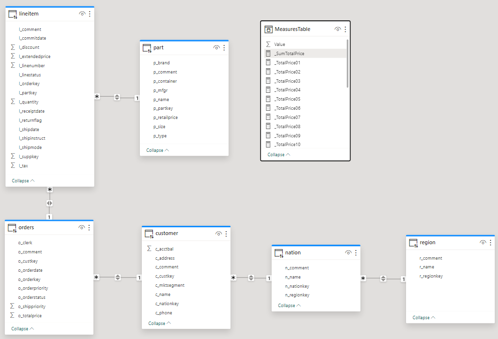
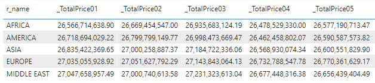

# Query Parallelization

## Introduction
When using Databrics Lakehouse, one of the greatest benefits of using Power BI is that we can build report which process hundreds gigabytes or even terabytes of data. That is possible when using **Direct Query** mode which uses Databricks SQL as the backend and does not require loading all data into in-memory cache. Therefore, in order to achieve optimal performance it's important to understand to understand how Power BI generates and executes SQL-query when using **Direct Query** mode.

In this sample we will see some of the aspects of query parallelization in Power BI model when using Direct Query mode.

## Pre-requisites
1. Databricks workspace.
2. Databricks SQL Warehouse, Small cluster size, min=max=2.
3. Power BI Desktop, latest version is recommended.
4. Power BI **Premium** workspace, the demos are built using Power BI Embedded A4, A6, A7.
5. [Tabular Editor](!https://tabulareditor.com/), free version is sufficient.
6. [DAX Studio](!https://daxstudio.org/).

## Step by Step Walkthrough
### Report Design
Our report is based on **samples** catalog, **tpch** schema. It used **orders** as fact table in **Direct Query** mode and **region**, **nation**, and **customer** as dimension tables in different modes.


There are also 20 calculated measures defined in the model in **MeasuresTable**.
```
_SumTotalPrice = SUM(orders[o_totalprice])
_TotalPrice01 = CALCULATE([_SumTotalPrice], part[p_container]="JUMBO BAG")
_TotalPrice02 = CALCULATE([_SumTotalPrice], part[p_container]="JUMBO BOX")
...
```

The report layout include a single table where all 20 calculated measures are displayed (the screenshot is clipped to 5 measures only).



### Testing Approach
The report is purposefully designed in such way that it generates **20** separate SQL-queries to render the Table visual.
We used Power BI Desktop Performance Analyzer to extract DAX-query which is generated by the Table visual. It is also available in this repo as [SampleQuery.dax](./SampleQuery.dax).
```
DEFINE
	VAR __DS0Core = 
		SUMMARIZECOLUMNS(
			'region'[r_name],
			"v_TotalPrice01", 'MeasuresTable'[_TotalPrice01],
			"v_TotalPrice02", 'MeasuresTable'[_TotalPrice02],
			"v_TotalPrice03", 'MeasuresTable'[_TotalPrice03],
			"v_TotalPrice04", 'MeasuresTable'[_TotalPrice04],
			"v_TotalPrice05", 'MeasuresTable'[_TotalPrice05],
			"v_TotalPrice06", 'MeasuresTable'[_TotalPrice06],
			"v_TotalPrice07", 'MeasuresTable'[_TotalPrice07],
			"v_TotalPrice08", 'MeasuresTable'[_TotalPrice08],
			"v_TotalPrice09", 'MeasuresTable'[_TotalPrice09],
			"v_TotalPrice10", 'MeasuresTable'[_TotalPrice10],
			"v_TotalPrice11", 'MeasuresTable'[_TotalPrice11],
			"v_TotalPrice12", 'MeasuresTable'[_TotalPrice12],
			"v_TotalPrice13", 'MeasuresTable'[_TotalPrice13],
			"v_TotalPrice14", 'MeasuresTable'[_TotalPrice14],
			"v_TotalPrice15", 'MeasuresTable'[_TotalPrice15],
			"v_TotalPrice16", 'MeasuresTable'[_TotalPrice16],
			"v_TotalPrice17", 'MeasuresTable'[_TotalPrice17],
			"v_TotalPrice18", 'MeasuresTable'[_TotalPrice18],
			"v_TotalPrice19", 'MeasuresTable'[_TotalPrice19],
			"v_TotalPrice20", 'MeasuresTable'[_TotalPrice20]
		)

	VAR __DS0PrimaryWindowed = 
		TOPN(501, __DS0Core, 'region'[r_name], 1)

EVALUATE
	__DS0PrimaryWindowed

ORDER BY
	'region'[r_name]
```

We published the report to a Power BI Premium workspace and used DAX-query in [DAX Studio](!https://daxstudio.org/) to analyze the behavior when using different Power BI SKUs.


### Default Behavior
#### P1/A4 SKU


#### P2/A5 SKU


#### P3/A6 SKU


#### P4/A7 SKU


#### Summary
So we achieved the following results.
| SKU    | v-Cores | Parallelism | End-to-end performance |
| ------ | ------- | ----------- | ---------------------- |
| P1/A4  | 8       |    4        |        3,377 ms        |
| P2/A5  | 16      |    6        |        3,422 ms        |
| P3/A6  | 32      |    8        |        3,017 ms        |
| P4/A7  | 64      |    10       |        2,391 ms        |

As we can see the query parallelism increases with the SKU, hence the performance. However, when using P4/A7 and higher SKU the query parallelism does not grow further, because it's limited by Data Source Default Max Connection setting in the report which is equal **10** by default. 

***Please note that: 1) performance numbers are not precise. You may observer different performance in your environment; 2) Microsoft has not documented the default behaviour of query parallelism, hence it may change and your results may be different.***

### Adjusting Model Properties
As we may not be satisfied with the achieved query parallelisation and overall performance, we may want to increase query parallelism. This was introduced by Microsoft back in March 2023 and described in the following blog post - 
[Query parallelization helps to boost Power BI dataset performance in DirectQuery mode](!https://powerbi.microsoft.com/en-us/blog/query-parallelization-helps-to-boost-power-bi-dataset-performance-in-directquery-mode/).
According to Microsoft blog post, we change the properties of the published datasets with the help of [Tabular Editor](!https://tabulareditor.com/). We change the properties as follows:
1. Database Compatibility Level = 1569 to unlock new settings
2. Max Parallelism Per Query = 20 to parallelize all 20 queries in our report
3. Data Source Default Max Connections = 20 to enable 20 connections to Databricks SQL.


Additionally we need to make sure that our backend, i.e. Databricks SQL Warehouse, is capable to handle 20 SQL-queries simultaneously. Therefore, we recommend setting **min** number of clusters as 2.


### Increased Query Parallelization

#### P1/A4 SKU

#### P2/A5 SKU

#### P3/A6 SKU

#### P4/A7 SKU


#### Summary
So we achieved the following results.
| SKU    | v-Cores | Parallelism | End-to-end performance |
| ------ | ------- | ----------- | ---------------------- |
| P1/A4  | 8       |     8       |        2,110 ms        |
| P2/A5  | 16      |     12      |        2,375 ms        |
| P3/A6  | 32      |     16      |        1,547 ms        |
| P4/A7  | 64      |     20      |        860 ms          |

## Conclusion
As we saw in this example, with the fine tuning of the datasets in Power BI Premium SKUs we can achieve a better query parallelism, hence better performance and user experience.
Please note that actual query parallelism is always limited by the lowest of all limiting factors which include:
1. Max Parallelism Per Query
2. Data Source Default Max Connections
3. Databricks SQL Warehouse capacity
4. Power BI Gateway capacity (if used).

## Power BI Template 
A sample Power BI template [Query-Parallelization.pbit](Query-Parallelization.pbit)) is present in the current folder. When opening the template, enter respective **ServerHostname** and **HTTP Path** values of your Databricks SQL Warehouse. The template uses **samples** catalog, therefore you don't need to prepare any additional data for this report.