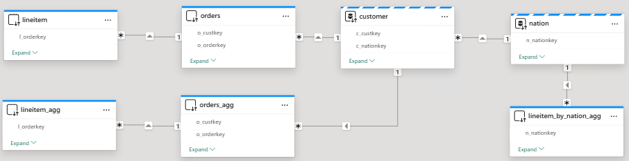
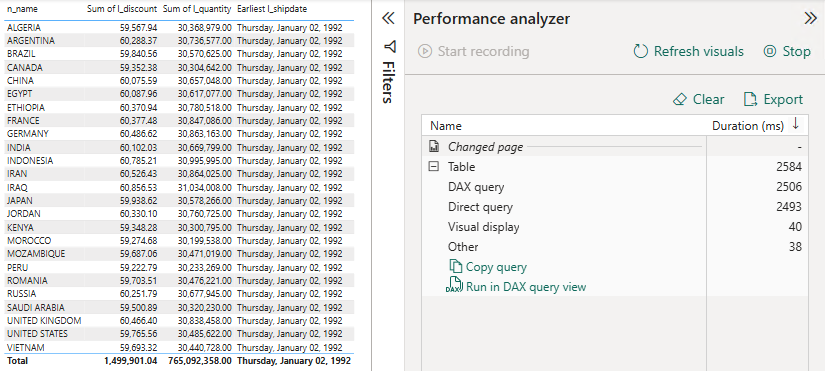
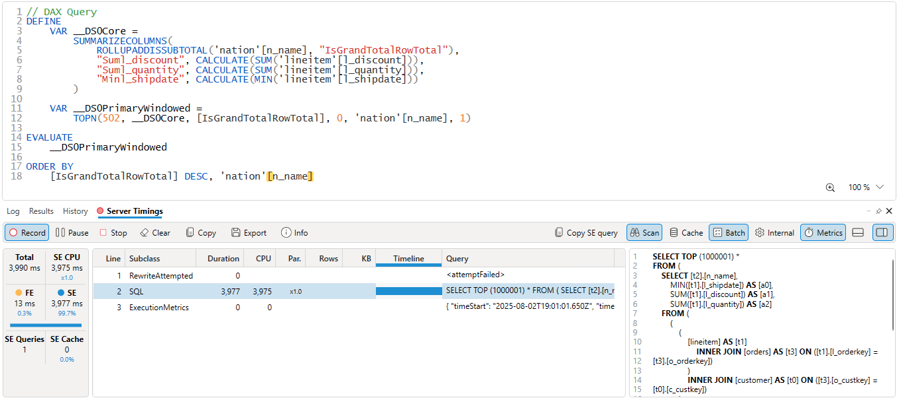
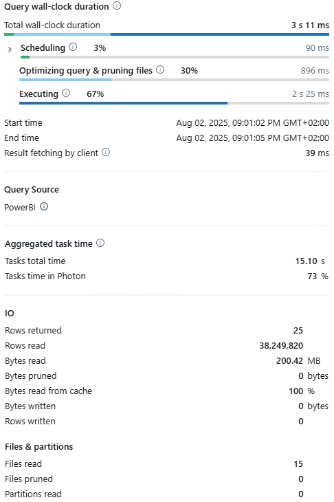
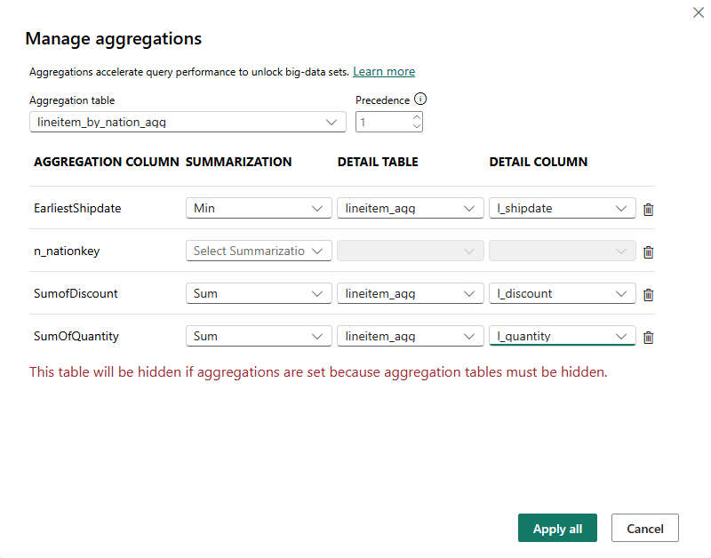
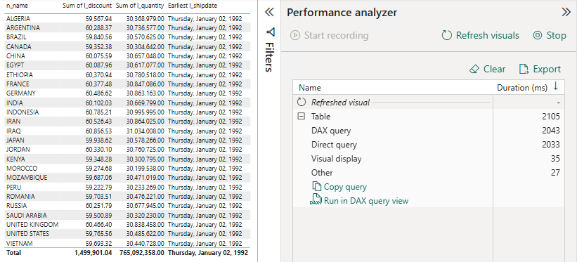
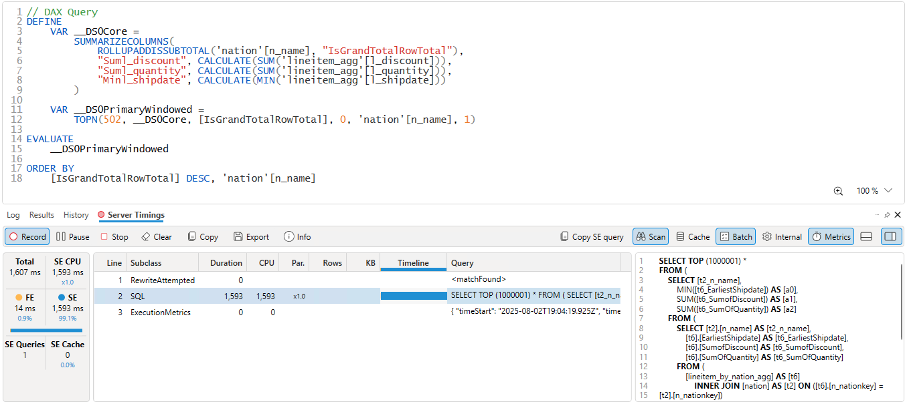
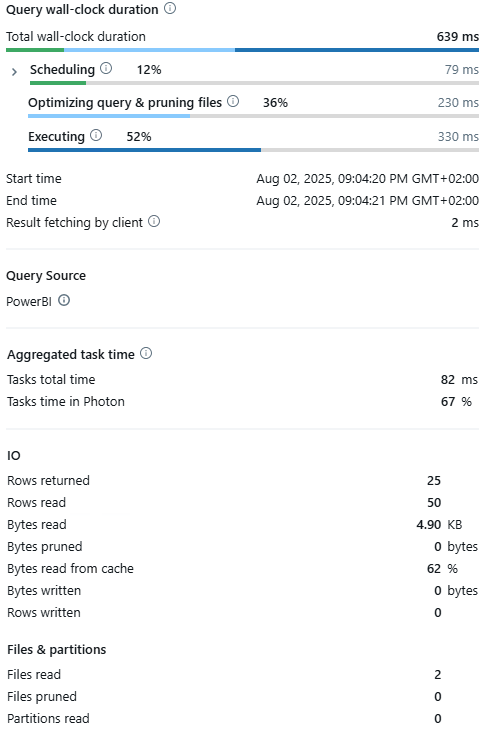

# User-defined Aggregations
 
## Introduction

[User-defined aggregations](https://learn.microsoft.com/en-us/power-bi/transform-model/aggregations-advanced) are a powerful - yet often overlooked - tool for optimizing query performance, especially when working with large *DirectQuery* semantic models. By configuring specialized aggregation tables within your data model, you enable Power BI to automatically serve commonly requested summaries from in-memory cache rather than querying the backend source each time. This not only delivers faster and more responsive reports but also reduces the workload on source systems, making your analytics solutions more scalable and efficient.

In this quickstart, you’ll learn how to set up [User-defined aggregations](https://learn.microsoft.com/en-us/power-bi/transform-model/aggregations-advanced) and see first-hand how they can significantly boost the performance of your Power BI semantic models.


## Prerequisites

Before you begin, ensure you have the following:

- [Databricks account](https://databricks.com/), access to a Databricks workspace, Unity Catalog, and Databricks SQL Warehouse
- [Power BI Desktop](https://powerbi.microsoft.com/desktop/), latest version is highly recommended


## Step by step walkthrough

### 1. Data Model

1. Create a catalog and a schema in Databricks Unity Catalog.
    ```sql
    CREATE CATALOG IF NOT EXISTS powerbiquickstarts;
    USE CATALOG powerbiquickstarts;
    CREATE SCHEMA IF NOT EXISTS tpch;
    USE SCHEMA tpch;
    ```

2. Create test tables in the catalog by replicating tables from **`samples`** catalog.
    ```sql
   CREATE OR REPLACE TABLE nation AS SELECT * FROM samples.tpch.nation;
   CREATE OR REPLACE TABLE customer AS SELECT * FROM samples.tpch.customer;
   CREATE OR REPLACE TABLE orders AS SELECT * FROM samples.tpch.orders;
   CREATE OR REPLACE TABLE lineitem AS SELECT * FROM samples.tpch.lineitem;

   CREATE OR REPLACE TABLE lineitem_by_nation_agg AS
   SELECT
   `n_nationkey`
   , min(`l_shipdate`) as `EarliestShipdate`
   , sum(`l_discount`) as `SumofDiscount`
   , sum(`l_quantity`) as `SumOfQuantity`
   FROM `samples`.`tpch`.`lineitem` 
      INNER JOIN `samples`.`tpch`.`orders` on `l_orderkey` = `o_orderkey`
      INNER JOIN `samples`.`tpch`.`customer` on `o_custkey` = `c_custkey`
      INNER JOIN `samples`.`tpch`.`nation` on `c_nationkey` = `n_nationkey`
   GROUP BY ALL;
    ```

1. Open Power BI Desktop → **"Home"** → **"Get Data"** → **"More..."**.

2. Search for **Databricks** and select **Azure Databricks** (or **Databricks** when using Databricks on AWS or GCP).

3. Enter the following values:
   - **Server Hostname**: Enter the Server hostname value from Databricks SQL Warehouse connection details tab.
   - **HTTP Path**: Enter the HTTP path value  from Databricks SQL Warehouse connection details tab.

> [!TIP]
> We recommend parameterizing your connections. This really helps ease out the Power BI development and administration expeience as you can easily switch between different environments, i.e., Databricks Workspaces and SQL Warehouses. For details on how to paramterize your connection string, you can refer to [Connection Parameters](/01.%20Connection%20Parameters/) article.

4. Connect to **`powerbiquickstarts`** catalog, **`tpch`** schema.

5. Add tables to the semantic model as follows.
   - **`customer`** - *Dual* storage mode. Dimension table containing customer information and connected to nation dimension table using nationkey.
   - **`nation`** - *Dual* storage mode. Dimension table containing nation name and details.
   - **`orders`** - *DirectQuery* storage mode. Fact table containing orders information and connected to customer dimension using customerkey.
   - **`lineitem`** - *DirectQuery* storage mode. Fact table containing details like order shipment date, discount price etc. 
   - **`orders_agg`** - *DirectQuery* storage mode. Copy of **`orders`** table and used for aggregate table report.
   - **`lineitem_agg`** - *DirectQuery* storage mode. Copy of **`lineitem`** table and used for aggregate table report.
   - **`lineitem_by_nation_agg`** - *DirectQuery* storage mode. Aggregated **`lineitem`** data.

8. Create table relationships as follows.
   - **`nation`** → **`customer`** → **`orders`** → **`lineitem`** 
   - **`nation`** → **`customer`** → **`orders_agg`** → **`lineitem_agg`** 
   - **`nation`** → **`lineitem_by_nation_agg`**
   
> [!IMPORTANT]
> The relationship between **`nation`** and **`lineitem_by_nation_agg`** must **be One to many (1:*)** with **Single** cross-filter direction.

   The resulting data model should look like on the screenshot below.

   


Next, we will analyze the performance of a test report using pure *DirectQuery* mode and *User-defined Aggregation*.


#### 2.2. DirectQuery

1. Create a new report page. Add a Table visual. Add columns to the Table visual as follows.
   - **`n_nation`** from **`nation`** table
   - Sum of **`l_discount`** from **`lineitem`** table
   - Sum of **`l_quantity`** from **`lineitem`** table
   - Earliest **`l_shipdate`** from **`lineitem`** table

2. Open **Optimize** → **Performance Analyzer** → **Start Recording** → **Refresh visuals**.

4. Perfomance Analyzer tab will display the Table visual and a DAX query. Click on **Copy Query**. The DAX query should look similar to [Sample DAX Query](./scripts/Sample_DAX_Query.dax) script. Below is the screenshot of *DirectQuery* report page.
   
   

5. To compare the performance between *pure DirectQuery* and *User-defined Aggregations*, it is important to get objective and precise query execution times.

6. Open **DAX Studio**, click **Connect**, choose local Power BI mode, click **Connect**, and click **Server Timings**.

7. Open the [Sample_DAX_Query.dax](./scripts/Sample_DAX_Query.dax) query or paste DAX-query that was previously copied in Power BI Desktop. Click **Run**. As shown in screenshot below, the query takes **3.977 sec**.

   

9. You can also find the SQL-query execution time by looking at Databricks Query History. As shown below, the query took **3.011 sec** and read **~38M** rows. 

   

   The SQL-query looks as follows. Power BI built a SQL-query joining **`nation`** dimension table with **`orders`** and **`lineitem`** fact tables.   
   

   ``` sql
   select ...
   from
   (
      select ...
      from
         (
         select ...
         from
            (
               select ...
               from
               (
                  select ...
                  from
                     `powerbiquickstarts`.`tpch`.`lineitem` as `OTBL`
                     inner join `powerbiquickstarts`.`tpch`.`orders` as `ITBL`
                        on (`OTBL`.`l_orderkey` = `ITBL`.`o_orderkey`)
               ) as `OTBL`
                  inner join `powerbiquickstarts`.`tpch`.`customer` as `ITBL`
                     on (`OTBL`.`o_custkey` = `ITBL`.`c_custkey`)
            ) as `OTBL`
               inner join `powerbiquickstarts`.`tpch`.`nation` as `ITBL`
               on (`OTBL`.`c_nationkey` = `ITBL`.`n_nationkey`)
         ) as `ITBL`
      group by
         `n_name`
   ) as `ITBL`
   where ...
   ```


#### 2.3. User-defined Aggregations

1. Switch to Power BI Desktop → **Model view**.

2. Right Click **lineitem_by_nation_agg** → **Manage aggregations**.

3. Configure aggregation table as shown below on the screenshot.

   | Aggregation column | Summarization | Detail table | Detail column |
   | ---------------------- | --- | ------------------ | ---------------- |
   | **`n_nationkey`**      | -   |     -              |        -         |
   | **`EarliestShipdate`** | Min | **`lineitem_agg`** | **`l_shipdate`** |
   | **`SumofDiscount`**    | Sum | **`lineitem_agg`** | **`l_discount`** |
   | **`SumOfQuantity`**    | Sum | **`lineitem_agg`** | **`l_quantity`** |

   

4. Create a new report page. Add a Table visual. Add columns to the Table visual as follows.
   - **`n_nation`** from **`nation`** table
   - Sum of **`l_discount`** from **`lineitem_agg`** table
   - Sum of **`l_quantity`** from **`lineitem_agg`** table
   - Earliest **`l_shipdate`** from **`lineitem_agg`** table

2. Open **Optimize** → **Performance Analyzer** → **Start Recording** → **Refresh visuals**.

7. Perfomance Analyzer tab will display the Table visual and a DAX query. Click on **Copy Query**. The DAX query should look similar to [Sample_DAX_Query_Using_Aggregations](./scripts/Sample_DAX_Query_Using_Aggregations.dax) script. Below is the screenshot of **User-defined Aggregation** report page.

   

8. Open **DAX Studio**, click **Connect**, choose local Power BI mode, click **Connect**, and click **Server Timings**.

9. Open the [Sample_DAX_Query_Using_Aggregations.dax](./scripts/Sample_DAX_Query_Using_Aggregations.dax) query or paste DAX-query that was previously copied in Power BI Desktop. Click **Run**.

10. As shown in screenshot below the query takes **1.593 sec**.
   
      
   
      Also, as shown in the screenshot, the first row under **RewriteAttempted** shows **MatchFound**, i.e., Power BI was able to find the aggregate table for this query. Hence, during the query execution as shown in the screenshot the values are fetched from **`lineitem_by_nation_agg`** instead of **`lineitem_agg`** fact table.

11. You can also find the query execution time by looking at Databricks Query History. As shown below the query took **~0.639 sec** and read only **50** rows (instead of ~**38M** rows). 
      
      
      
      The SQL-query looks as follows. Power BI built a SQL-query joining **`nation`** dimension table with aggregated table **`lineitem_by_nation_agg`** which is much smaller than **`orders`** and **`lineitem`**, hence the query is much more efficient.

      ``` sql
      select ...
      from
      (
         select ...
         from
            (
            select ...
            from
               `powerbiquickstarts`.`tpch`.`lineitem_by_nation_agg` as `OTBL`
                  inner join `powerbiquickstarts`.`tpch`.`nation` as `ITBL`
                  on (`OTBL`.`n_nationkey` = `ITBL`.`n_nationkey`)
            ) as `ITBL`
         group by
            `n_name`
      ) as `ITBL`
      where ...
      ```

**Thus, by utilizing User-defined aggregation we achieved much higher performance and decreased the amount of I/O operations.**

> [!TIP]
> If you observe similar performance for both non-aggregated and aggregated tables, this may be due to results being served from Query Result Cache. To mitigate this, you may recreate test tables after configuring the report by executing SQL-statements mentioned above.


## Conclusion

[User-defined aggregations](https://learn.microsoft.com/en-us/power-bi/transform-model/aggregations-advanced) in Power BI provide significant performance benefits, especially for large semantic models utilizing *DirectQuery*. By defining specialized aggregation tables, Power BI can automatically redirect queries for summary information to these pre-aggregated tables, allowing frequently needed results to be served from a much smaller and efficient in-memory cache instead of the full detail tables in the backend. This results in much faster and more responsive reporting, drastically reducing query times and the number of rows scanned during execution - for example, dropping from tens of millions of rows to just a few dozen in test scenarios. This approach not only speeds up report visuals but also decreases the workload on source systems like Databricks SQL, leading to increased scalability, reduced resource consumption, and better overall efficiency for enterprise analytics solutions. User-defined aggregations are powerful for enabling high performance and responsive analytics on vast datasets without compromising detail or accuracy.


## Power BI Template

A Power BI template [User-defined Aggregations.pbit](./User-defined%20Aggregations.pbit), as well as supporting [scripts](./scripts/), are present in this folder to demonstrate the usage of *User-defined Aggregations* outlined above. To use the template, simply enter your Databricks SQL Warehouse's **`ServerHostname`** and **`HttpPath`**, along with the **`Catalog`** and **`Schema`** names that correspond to the environment set up in the instructions above.
