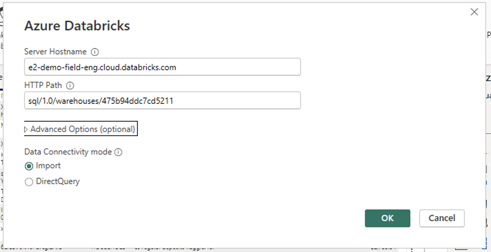

# Improving Performance of Power BI Reports using User-defined Aggregations
 
## Introduction
[User-defined aggregations](https://learn.microsoft.com/en-us/power-bi/transform-model/aggregations-advanced) are the unsung heroes of Power BI, quietly optimizing performance and efficiency behind the scenes. In the dynamic world of data analysis, where speed and accuracy are paramount, these specialized tables play a crucial role in improving performance for large Power BI dataset in DirectQuery storage mode. This guide explains how we can set up **User-defined aggregations** and also showcases how **User-defined aggregations** help improve performance of Power BI datasets. You can follow the steps mentioned in the [Step by Step Instructions](#step-by-step-instructions) section.

## Pre-requisites

Before you begin, ensure you have the following:

- [Databricks account](https://databricks.com/) and access to a Databricks workspace and also have Databricks SQL Warehouse set up .
- [Power BI Desktop](https://powerbi.microsoft.com/desktop/) installed on your machine.

## Step by Step Instructions

### 1. Databricks Data Source Connection 

1. Open Power BI Desktop
2. Go to **Home** -> **Get Data** -> **More...**
3. Search for **Databricks** and select **Azure Databricks** (or **Databricks** when using Databricks on AWS or GCP).
4. Enter the following values:
   - **Server Hostname**: Enter the Server hostname value from Databricks SQL Warehouse connection details tab.
   - **HTTP Path**: Enter the HTTP path value  from Databricks SQL Warehouse connection details tab.

Below is the sample screenshot of how the data source would look like

### Best Practice 
It is always a good practice to parameterize your connection string. This really helps ease out the development expeience as you can dynamically connect to any Databricks SQL Warehouse. For details on how to paramterize your connection string you can refer to [this](/01.%20Connecting%20Power%20BI%20to%20Databricks%20SQL%20using%20Parameters) article.

### 2. Perfromance Improvement with User-defined Aggregations
In the next section we will showcase how **User-defined Aggregation** table help improve performance of your Power BI report. We will do this by analyzing query performance of two similar reports. The first will be using original tables using Direct Query mode and in the other we will be using **User-defined Aggregation** table. For our testing scenario we are using a "**Small**" Pro cluster.

#### 2.1 Data Model Creation
To make performance testing easy to follow we will use **samples** catalog and **tpch** schema which are available in any Databricks Workspace and add below mentioned tables. We will also create an aggregate table by running the DDL script against **hive_metastore** catalog and **default** schema as **samples** catalog is read-only.

1. **customer**: Storage mode as Dual. Dimension table containing customer information and connected to nation dimension table using nationkey.

2. **nation**: Storage mode as Dual. Dimension table containing nation name and details.

3. **orders**: Storage mode as Direct Query. Fact table containing orders information and connected to customer dimension using customerkey.

4. **lineitem**: Storage mode as Direct Query. Fact table containing details like order shipment date , discount price etc. 

5. **orders_agg**: Storage mode as Direct Query. Copy of **orders** table and used for aggregate table report.

6. **lineitem_agg**: Storage mode as Direct Query. Copy of **lineitem** table and used for aggregate table report.

7. **lineitem_by_nation_agg**: Storage mode as Direct Query.Run
[lineitem_by_customer_agg.sql](./scripts/lineitem_by_customer_agg.sql) DDL script to create table in hive_metastore. This table will be used to calculate aggregations we need for our aggreegate table report. 

Below is the screenshot of how our data model looks like.

For details on different storage modes in Power BI  refer to [this](/02.%20DirectQuery-Dual-Import) article.

#### 2.2 Direct Query report page 
In order to get best results and avoid caching it's better to run the test against warmed up SQL Warehouse by running few queries against SQL Warehouse. After SQL Warehouse is warmed up, follow below steps:
1. Click **Optimize** -> **Performance Analyzer** in Power BI desktop.
2. In the Performance Analyzer tab click "**Start Recording**".
3. Create a table visual with columns: nation name (from **nation** table), Sum of discount, Sum of quantity, and Earliest order ShipDate (from **lineitem** table).
4. Perfromance Analyzer tab will have a Table heading and a DAX query. Click on **Copy Query**. The DAX query should look similar to [Sample DAX Query](./scripts/Sample_DAX_Query.dax) script.

Below is the screenshot of Direct Query report page: 

##### 2.2.1 Query Analysis: DAX Studio and Databricks SQL
To compare the performance gains between *pure Direct Query* and *User-defined Aggregations* it is important to compare the query execution times.
1. Open **DAX Studio** and click Server Timings.
2. Open the [Sample_DAX_Query.dax](./scripts/Sample_DAX_Query.dax) query stored under **scripts** folder.
3. Click Run.

As shown in screenshot below the query takes **5.7s**. 

You can also find the query execution time by looking at query history in Databricks SQL. As shown below the query took **~3.7s** and read **~38M** rows. 

#### 2.3 User-defined Aggregation report page
##### 2.3.1 Manage Aggregations 
The first step is to configure Power BI model to use **lineitem_by_nation_agg** table created in Step 7 of section 2.1 as source of aggregated data. This helps with query performance as aggregations are pre-computed and Power BI will not need to read the whole fact table. In order to configure user-defined aggregations within Power BI follow below steps :

1. Open **Model view** in Power BI Desktop.

2. Right Click **lineitem_by_nation_agg** -> **Manage aggregations**.

3. Add the summarization, detail column and detail table as shown in below screenshot

##### 2.3.2 Create Aggregate Table visual report
1. Click **Optimize** -> **Performance Analyzer** in Power BI Desktop.
2. In the Performance Analyzer tab click **Start Recording**.
3. Create a table visual with columns: nation name (from **nation** table), Sum of discount, Sum of quantity, and Earliest order ShipDate (from **lineitem_agg** table).
4. Perfromance Analyzer tab will have a Table heading and a DAX query. Click on **Copy Query**. The DAX query should look similar to [Sample_DAX_Query_Using_Aggregations](./scripts/Sample_DAX_Query_Using_Aggregations.dax) script.
Below is the screenshot of **User-defined Aggregation** report page: 

##### 2.3.3 Query Analysis: DAX Studio and Databricks SQL 
1. Open **DAX Studio** and click Server Timings.
2. Open the [Sample_DAX_Query_Using_Aggregations.dax](./scripts/Sample_DAX_Query_Using_Aggregations.dax) query stored under **scripts** folder.
3. Click Run.
As shown in screenshot below the query takes **2.8 sec**.
 Also as shown in the screenshot the first row under "**RewriteAttempted**" shows "**MatchFound**" i.e. Power BI was able to find the aggregate table for this query. Hence during the query execution as shown in the screenshot the values are fetched from **lineitem_by_nation_agg** instead of **lineitem_agg** fact table.
You can also find the query execution time by looking at query history in Databricks SQL. As shown below the query took **~2.8s** and read only **50** rows (instead of ~**38M** rows). 

As we can see **User-defined Aggregations** tables give performance benefit of ~**50%** over pure Direct Query by reading much less data, **order of magnitude** in our case, from **lineitem_by_nation_agg** as compared to pure Direct Query which reads directly from fact tables.

## Power BI Template 

To automate the process and ease the deployment process save the report as Power BI template. A sample Power BI template [User-Defined-Aggregations.pbit](./User-Defined-Aggregations.pbit) is already present in the current folder pointing to  **samples** catalog and **tpch** schema. Please run [lineitem_by_customer_agg.sql](./scripts/lineitem_by_customer_agg.sql) DDL script to create table in HMS before running opening Power BI template. Once done when you open the template enter respective **ServerHostname** and **HTTP Path** values of your Databricks SQL Warehouse. The report will contain **Warmup** report page (to warm up SQL Warehouse), **Direct Query** report page reading from original tables, and **User-defined Aggregations** report page which use aggregation table. You can then follow secion 2.2 and 2.3 above to do performance analysis between both the reports. 
