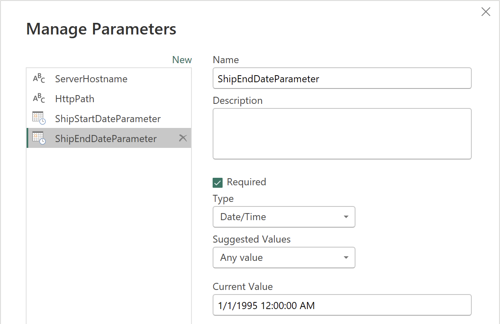
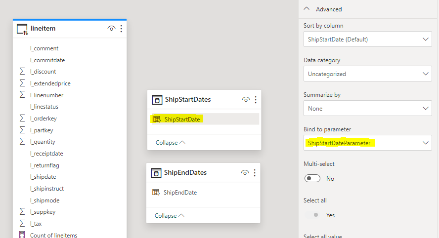
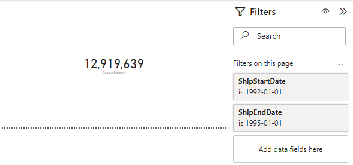

# Dynamic M Query Parameters

## Introduction

[Dynamic M query parameters](https://learn.microsoft.com/en-us/power-bi/connect-data/desktop-dynamic-m-query-parameters) empower model authors to let report viewers set filter or slicer values that are directly passed as M query parameters. This powerful capability allows authors to precisely control how filter selections are incorporated into _DirectQuery_ source queries, ensuring that queries are constructed for optimal performance and accuracy. By using dynamic M query parameters, you can fine-tune your Power BI reports to deliver more efficient, responsive analytics - making them especially valuable for optimizing query performance in complex data scenarios


## Prerequisites

Before you begin, ensure you have the following:

- [Databricks account](https://databricks.com/), access to a Databricks workspace, Unity Catalog, and SQL Warehouse
- [Power BI Desktop](https://powerbi.microsoft.com/desktop/), latest version is highly recommended


## Step by Step Walkthrough

1. Open Power BI Desktop → **"Home"** → **"Get Data"** → **"More..."**.

2. Search for **Databricks** and select **Azure Databricks** (or **Databricks** when using Databricks on AWS or GCP).

3. Enter the following values:
   - **Server Hostname**: Enter the Server hostname value from Databricks SQL Warehouse connection details tab.
   - **HTTP Path**: Enter the HTTP path value  from Databricks SQL Warehouse connection details tab.

> [!TIP]
> We recommend parameterizing your connections. This really helps ease out the Power BI development and administration expeience as you can easily switch between different environments, i.e., Databricks Workspaces and SQL Warehouses. For details on how to paramterize your connection string, you can refer to [Connection Parameters](/01.%20Connection%20Parameters/) article.

4. Connect to **`samples`** catalog, **`tpch`** schema.

3. Add **`lineitem`** table. Set the table to **DirectQuery** mode.

4. Next, in the Power Query Editor, define 2 parameters - **`ShipStartDateParameter`** and **`ShipEndDateParameter`** - which we will use to filter data in the fact table.

    

5. Next, adjust M-query for **`lineitem`** table as follows. Here, add an extra operation to filter the records based on **`l_shipdate`** column and **`ShipStartDateParameter`**/**`ShipEndDateParameter`** parameter values.
    ```
    let
        Source = Databricks.Catalogs(HostName, HttpPath, [Catalog=null, Database=null, EnableAutomaticProxyDiscovery=null]),
        samples_Database = Source{[Name="samples",Kind="Database"]}[Data],
        tpch_Schema = samples_Database{[Name="tpch",Kind="Schema"]}[Data],
        lineitem_Table = tpch_Schema{[Name="lineitem",Kind="Table"]}[Data],
        #"Changed Type" = Table.TransformColumnTypes(lineitem_Table,{{"l_shipdate", type datetime}}),
        #"Filtered Rows" = Table.SelectRows(#"Changed Type", each [l_shipdate] >= ShipStartDateParameter and [l_shipdate] <= ShipEndDateParameter)
    in
        #"Filtered Rows"
    ```

6. Next, create 2 tables for each parameter which contain possible values available to be dynamically set based on filter selection. You can use a query to a data source to create such a table. Alternatively you can define them as calculated tables. 
    ```
    ShipStartDates = CALENDAR("1/1/1992", "31/12/1998")
    ShipEndDates = CALENDAR("1/1/1992", "31/12/1998")
    ```

7. At the next step we bind previously created parameters to the columns in date tables.
    - `ShipStartDateParameter` → `ShipStartDates.ShipStartDate`
    - `ShipEndDateParameter` → `ShipEndDates.ShipEndDate`
    

6. Finally, build a sample report and filter data based on **`ShipStartDate`** and **`ShipEndDate`** columns.

    

    The report generates the following SQL-query.
    ```sql
    select ...
    from
    (
        select ...
        from
        (
            select ...
            from
                `samples`.`tpch`.`lineitem`
        ) as `ITBL`
        where
            `C1` >= { ts '1992-01-01 00:00:00' }
            and `C1` <= { ts '1995-01-01 00:00:00' }
    ) as `ITBL`
    ```


## Conclusion

Using [Dynamic M query parameters in Power BI](!https://learn.microsoft.com/en-us/power-bi/connect-data/desktop-dynamic-m-query-parameters) enables model authors to pass filter or slicer values specified by report viewers directly into M queries, which are then incorporated into DirectQuery source queries. This approach provides precise control over how filter selections are reflected in SQL queries, ensuring queries are generated for maximum efficiency and accuracy. The key benefits include more efficient and responsive analytics, improved query performance - especially with large datasets or complex data scenarios - and reduced workload for both the data source and Power BI itself. Ultimately, this technique helps optimize report interactivity and delivers a smoother user experience by minimizing unnecessary data retrieval and processing.


## Power BI Template 
A Power BI template [Dynamic M Query Parameters.pbit](./Dynamic%20M%20Query%20Parameters.pbit) is present in this folder to demonstrate the approach of Dynamic M query parameters outlined above. To use the template, simply enter your Databricks SQL Warehouse's **`ServerHostname`** and **`HttpPath`** that correspond to the environment set up in the instructions above. The template uses **`samples`** catalog, therefore you don't need to prepare any additional dataset.