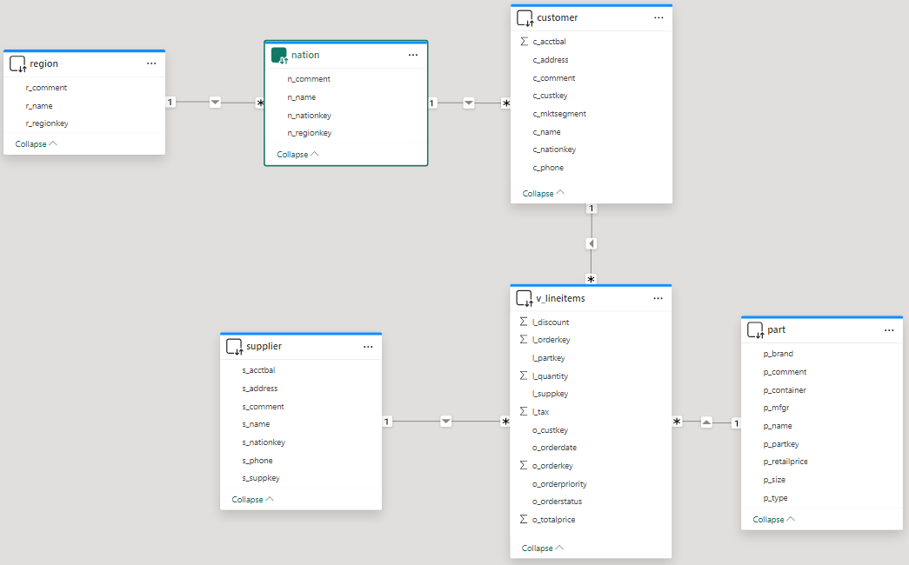
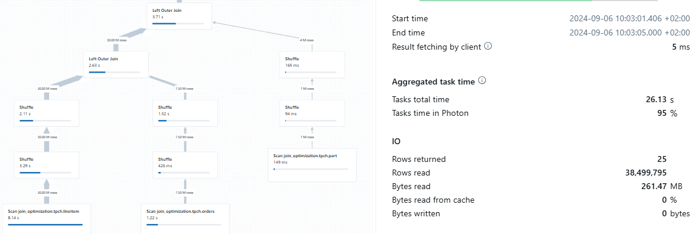
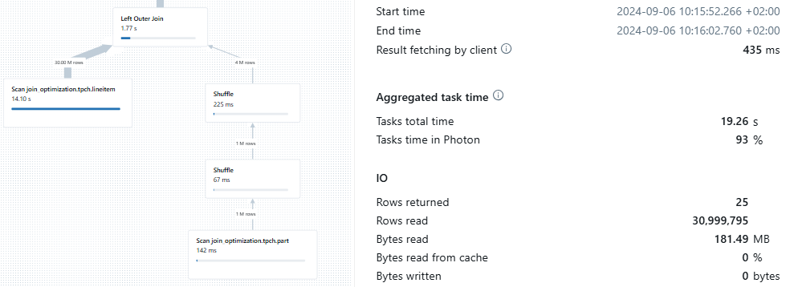

# Query optimization using primary key constraints

## Introduction

Understanding the relationships between columns in your tables is essential for effective data management and analytics. Primary key constraints play a crucial role in defining these relationships, making it easier for users and tools to interpret data structure. In Databricks, while primary key constraints are not enforced, the platform provides a **RELY** option for primary key constraints. This option allows the Databricks engine to utilize these constraints as hints for optimizing query performance in certain scenarios. For a detailed explanation of how this feature can enhance query optimization, refer to the [Query optimization using primary key constraints](https://learn.microsoft.com/en-us/azure/databricks/sql/user/queries/query-optimization-constraints) article.


## Prerequisites

Before you begin, ensure you have the following:

- [Databricks account](https://databricks.com/), access to a Databricks workspace, Unity Catalog, and SQL Warehouse
- [Power BI Desktop](https://powerbi.microsoft.com/desktop/), latest version is highly recommended


## Step by step walkthrough
1. Create a catalog and a schema in Databricks Unity Catalog.
    ```sql
    CREATE CATALOG IF NOT EXISTS powerbiquickstarts;
    USE CATALOG powerbiquickstarts;
    CREATE SCHEMA IF NOT EXISTS tpch;
    USE SCHEMA tpch;
    ```

2. Create tables in the new catalog by replicating tables from **samples** catalog.
    ```sql
    -- Create test tables based on samples.tpch dataset
    CREATE OR REPLACE TABLE lineitem AS SELECT * FROM samples.tpch.lineitem;
    CREATE OR REPLACE TABLE orders AS SELECT * FROM samples.tpch.orders;
    CREATE OR REPLACE TABLE part AS SELECT * FROM samples.tpch.part;
    CREATE OR REPLACE TABLE supplier AS SELECT * FROM samples.tpch.supplier;
    CREATE OR REPLACE TABLE customer AS SELECT * FROM samples.tpch.customer;
    CREATE OR REPLACE TABLE nation AS SELECT * FROM samples.tpch.nation;
    CREATE OR REPLACE TABLE region AS SELECT * FROM samples.tpch.region;
    ```

3. Drop primary keys on the tables which may exist if you already had the tables since previous experiments.
    ```sql
    ALTER TABLE orders DROP PRIMARY KEY IF EXISTS;
    ALTER TABLE part DROP PRIMARY KEY IF EXISTS;
    ALTER TABLE supplier DROP PRIMARY KEY IF EXISTS;
    ALTER TABLE customer DROP PRIMARY KEY IF EXISTS;
    ALTER TABLE nation DROP PRIMARY KEY IF EXISTS;
    ALTER TABLE region DROP PRIMARY KEY IF EXISTS;
    ```

4. Create a view over fact tables which you will be using in Power BI report. This view combines **orders** and ***lineitem*** data in the same tabular object (view).
    ```sql
    CREATE OR REPLACE VIEW v_lineitems as
    SELECT 
        l_orderkey, l_partkey, l_suppkey, l_quantity, l_tax, l_discount
        , o_orderkey, o_custkey, o_totalprice, o_orderstatus, o_orderdate, o_orderpriority
    FROM lineitem
        LEFT JOIN orders ON l_orderkey=o_orderkey;
    ```

5. Create a Power BI report, connect to Databricks SQL Warehouse, **`powerbiquickstarts`** catalog, **`tpch`** schema, add tables **`region`**, **`nation`**, **`customer`**, **`part`**, **`supplier`**, and the view **`v_lineitems`**. Use **DirectQuery** mode for all tables. Create relationships as shown on the screenshot.
    
    

6. On a report page, add a table visual, add columns:
    - `part[p_brand]` - **NO** aggregation
    - `v_lineitems[l_quantity]` - **SUM** aggregation
    - `v_lineitems[l_tax]` - **SUM** aggregation

7. In Databricks Query History you should be able to see the query profile for the SQL-query executed by Power BI. The engine scanned 3 tables **`lineitem`**, **`orders`**, and **`part`** and **261 MB** of data.
    

8. Now add primary key constraints with **RELY** option to the tables by executing the following SQL-statements.
    ```sql
    ALTER TABLE orders ALTER COLUMN o_orderkey SET NOT NULL;
    ALTER TABLE orders ADD PRIMARY KEY (o_orderkey) RELY;
    ALTER TABLE part ALTER COLUMN p_partkey SET NOT NULL;
    ALTER TABLE part ADD PRIMARY KEY (p_partkey) RELY;
    ALTER TABLE supplier ALTER COLUMN s_suppkey SET NOT NULL;
    ALTER TABLE supplier ADD PRIMARY KEY (s_suppkey) RELY;
    ALTER TABLE customer ALTER COLUMN c_custkey SET NOT NULL;
    ALTER TABLE customer ADD PRIMARY KEY (c_custkey) RELY;
    ALTER TABLE nation ALTER COLUMN n_nationkey SET NOT NULL;
    ALTER TABLE nation ADD PRIMARY KEY (n_nationkey) RELY;
    ALTER TABLE region ALTER COLUMN r_regionkey SET NOT NULL;
    ALTER TABLE region ADD PRIMARY KEY (r_regionkey) RELY;
    ```

9. Refresh data in the Power BI report. In Databricks Query History you should be able to see a new query profile for the SQL-query executed by Power BI. Now the engine scanned only 2 tables **`lineitem`** and **`part`** and **181 MB** of data.
This query execution was more efficient because Databricks SQL engine leveraged primary key constraint **RELY** option and identified that there is no need to scan **`orders`** table. **RELY** option in this case helped the engine to understand that joining **`orders`** table to **`lineitem`** table in **`v_lineitem`** view does not change the result of the query generated by Power BI, hence that join operation was skipped.
    

> [!CAUTION]
> Please note that using **RELY** option is only safe when you ensure data uniqueness in the respective column. Setting this option for non-unique primary key columns may lead to incorrect results.


10. Clean up your environment by dropping the catalog.
    ```sql
    DROP CATALOG IF EXISTS powerbiquickstarts CASCADE;
    ```


## Conclusion
As you could see in this example, the proper use of primary key constraints with **RELY** option can significantly improve the efficiency of SQL-queries. This is especially important for BI-workloads, such as Power BI, where star-schema is the recommended data modelling approach, hence joining multiple tables is common. More efficient query execution (less storage scan operations, lower CPU usage) is even more important in high-concurrency scenarios where multiple users generate 100s or even 1,000s queries per minute.

Adding primary key constraints with the **RELY** option allows the Databricks SQL engine to use these constraints as trusted hints for optimizing query performance, even though the constraints themselves are not enforced. When **RELY** is set, Databricks SQL can recognize uniqueness in key columns and make smarter decisions during query planning, such as avoiding unnecessary joins and reducing data scanned, which leads to more efficient query execution. For example, after applying **RELY** primary key constraints, Databricks was able to skip scanning and joining a table that did not affect the query result, thereby decreasing the data read and improving performance. This not only delivers significantly faster and more consistent query performance, but is also crucial in environments where many users are executing queries simultaneously, as it minimizes query latency and resource contention. However, this benefit relies on the data actually being unique in the constrained columns; otherwise, it may lead to incorrect query results.


## Power BI template 
A Power BI template [Query optimization using PK.pbit](./Query%20optimization%20using%20PK.pbit) and [Query optimization using PK.sql](./Query%20optimization%20using%20PK.sql) script are provided in this folder to demonstrate the query optimization concepts outlined above. To use the template, simply enter your Databricks SQL Warehouse's **ServerHostname** and **HttpPath**, along with the **Catalog** and **Schema** names that correspond to the environment set up in the instructions above.
