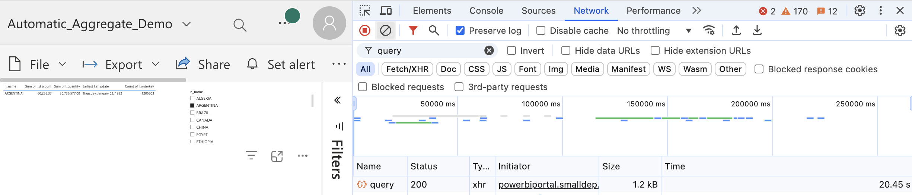

# Automatic Aggregations

## Introduction
As per Microsoft documentation:
> _[Automatic Aggregations](https://learn.microsoft.com/en-us/power-bi/enterprise/aggregations-auto) in Power BI use state-of-the-art machine learning (ML) to continuously optimize DirectQuery semantic models for maximum report query performance. Automatic aggregations are built on top of existing user-defined aggregations infrastructure first introduced with composite models for Power BI_.

In this quickstart, we showcase how to enable [Automatic Aggregations](https://learn.microsoft.com/en-us/power-bi/enterprise/aggregations-auto) on Power BI semantic model and train Automatic Aggregations in order to speed up exploring report. You can follow the steps mentioned in the [Step by step walkthrough](#step-by-step-walkthrough) section.


## Prerequisites

Before you begin, ensure you have the following:

- [Databricks account](https://databricks.com/), access to a Databricks workspace, Unity Catalog, and Databricks SQL Warehouse
- [Power BI Desktop](https://powerbi.microsoft.com/desktop/), latest version is highly recommended
- Power BI **Premium** workspace
- [DAX Studio](https://daxstudio.org/)


## Step by step walkthrough

1. Open Power BI Desktop → **"Home"** → **"Get Data"** → **"More..."**.

2. Search for **Databricks** and select **Azure Databricks** (or **Databricks** when using Databricks on AWS or GCP).

3. Enter the following values:
   - **Server Hostname**: Enter the Server hostname value from Databricks SQL Warehouse connection details tab.
   - **HTTP Path**: Enter the HTTP path value  from Databricks SQL Warehouse connection details tab.

> [!TIP]
> We recommend parameterizing your connections. This really helps ease out the Power BI development and administration expeience as you can easily switch between different environments, i.e., Databricks Workspaces and SQL Warehouses. For details on how to paramterize your connection string, you can refer to [Connection Parameters](/01.%20Connection%20Parameters/) article.

4. Connect to **`samples`** catalog, **`tpch`** schema.

5. Add tables as follows.Below is the data model for the sample report.
   - **`nation`** - dimension table set to **Dual** storage mode
   - **`customer`** - dimension table set to **Dual** storage mode
   - **`orders`** - fact table set to **DirectQuery** storage mode
   - **`lineitem`** - fact table set to **DirectQuery** storage mode.

6. Create table relationships as follows.
   - **`nation`** → **`customer`** → **`orders`** → **`lineitem`** 

7. The semantic model should look as on the screenshot below.

    

8. Create a simple tabular report displaying the **count** of orders, **min** shipment date, **sum** of discounts, and **sum** of quantities . Also add the slicer with **nation** names, as shown below.

    


9. Publish the report to Power BI Service, **Premium** workspace.

10. Open the report in a web browser. Use **Developer Tools** → **Network** to analyze performance.
> [!TIP]
> See more details here - [Capture a browser trace for troubleshooting](https://learn.microsoft.com/en-us/azure/azure-portal/capture-browser-trace)

11. Refresh visual. As shown below, in our environment it took **~20sec** to refresh the visuals.

    

    The screenshot below shows the query hit the Databricks SQL Warehouse and read 38M records. 

    

4. Now open the settings of the published semantic model in the **Premium** Power BI workspace.

5. Enable the Automatic Aggregations in the semantic model settings. You can set the **Query coverage** according to your needs. This setting will increase the number of user queries analyzed and considered for performance improvement. The higher percentage of Query coverage will lead to more queries being analyzed, hence higher potential benefits, however aggregations training will take longer. 

    

6. Power BI uses an internal query log to train aggregations. Thus, we need to populate the query log. We can achieve this by opening the report and interacting with the report by selecting different **`nation`** names in the slicer. Alternatively, you can run a sample [DAX-query](./Query.dax) in the [DAX Studio](https://daxstudio.org/).

    ```
    DEFINE
        VAR __DS0FilterTable = 
            TREATAS({"BRAZIL"}, 'nation'[n_name])

        VAR __DS0Core = 
            SUMMARIZECOLUMNS(
                'nation'[n_name],
                __DS0FilterTable,
                "Suml_discount", CALCULATE(SUM('lineitem'[l_discount])),
                "Suml_quantity", CALCULATE(SUM('lineitem'[l_quantity])),
                "Minl_shipdate", CALCULATE(MIN('lineitem'[l_shipdate])),
                "count_orderkey", 'lineitem'[count_orderkey]
            )

        VAR __DS0PrimaryWindowed = 
            TOPN(501, __DS0Core, 'nation'[n_name], 1)

    EVALUATE
        __DS0PrimaryWindowed

    ORDER BY
        'nation'[n_name]
    ```
> [!NOTE]
> Please note that for better aggregations training you need to run the multiple times by using different filter values for `n_nation` column.
 
7. Start the model training manually or schedule it.

    
   
8. Once the model is trained, Power BI will have aggregated values in in-memory cache. Next time you interact with the report using similar patterns (dimensions, measures, filters) Power BI will leverage cached aggregations to serve the queries and will not send queries to Databricks SQL Warehouse. Hence, you may expect sub-second report refresh performance.

9. Below screenshot shows how post enabling Automatic Aggregation no queries are fired as the data is read from cache.

    


## Conclusion

Power BI [Automatic Aggregations](https://learn.microsoft.com/en-us/power-bi/enterprise/aggregations-auto) leverage advanced machine learning to optimize *DirectQuery* semantic models and dramatically improve report performance. By analyzing user query patterns, Power BI automatically creates and manages in-memory aggregation tables, allowing frequently requested data to be served rapidly from cache instead of querying the backend data source each time. This results in much faster report visuals, reduced load on the source systems, and increased scalability - especially beneficial for large and complex datasets.

Unlike [User-defined aggregations](https://learn.microsoft.com/en-us/power-bi/transform-model/aggregations-advanced), automatic aggregations don't require extensive data modeling and query-optimization skills to configure and maintain.
Automatic aggregations require minimal setup, self-optimize over time, and remove the need for extensive manual modeling, making high-performance analytics accessible to users of all skill levels.


## Power BI Template 

A Power BI template [Automatic Aggregations.pbit](./Storage%20Modes.pbit) is present in this folder to demonstrate the difference in Power BI behaviour when using *Import*, *DirectQuery*, and *Dual* storage modes outlined above. To use the template, simply enter your Databricks SQL Warehouse's **`ServerHostname`** and **`HttpPath`** that correspond to the environment set up in the instructions above. The template uses **`samples`** catalog, therefore you don't need to prepare any additional dataset.