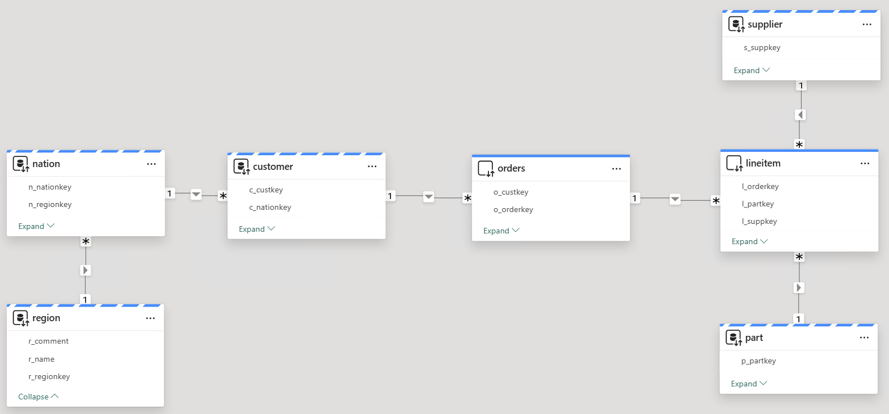

# Automatic Aggregation
## Introduction
As per Microsoft documentation, _[Automatic Aggregations](https://learn.microsoft.com/en-us/power-bi/enterprise/aggregations-auto) in Power BI use state-of-the-art machine learning (ML) to continuously optimize DirectQuery semantic models for maximum report query performance. Automatic aggregations are built on top of existing user-defined aggregations infrastructure first introduced with composite models for Power BI_.
In this example we will showcase how to enable Automatic Aggregations on Power BI semantic model and train Automatic Aggregations in order to speed up exploring report. You can follow the steps mentioned in the [Step by Step Instructions](#step-by-step-instructions) section.

## Pre-requisites

Before you begin, ensure you have the following:

- [Databricks account](https://databricks.com/), access to a Databricks workspace, and Databricks SQL Warehouse. 
- [Power BI Desktop](https://powerbi.microsoft.com/desktop/) installed on your machine. Latest version is highly recommended.
- Power BI **Premium** workspace
- [DAX Studio](https://daxstudio.org/)

  
## Step by Step Instructions
1. Create an initial Power BI dataset based on **samples** catalog, **tpch** schema. Add tables and relationships as shown on the screenshot below. The dimension tables **customer** and **nation** should be set to Dual storage mode. The fact tables **orders** and **lineitem** should be set to Direct Query storage mode. Below is the data model for the sample report.

    

2. Create a simple tabular report showing the **count** of orders and **min** shipment date, **sum** of discounts and **sum** of quantities . Also add the slicer with **nation** names, as shown below.

    


3. As shown below when we run the report it Power BI takes ~20sec to run the query . Below is the snapshot from the Network Trace :

    

    Also below screenshot shows query hit the Databricks SQL Warehouse and read 38M records. 

    


4. Now publish this report to a **Premium** workspace.

5. Enable the Automatic Aggregations in the samentic model settings. You can set the **Query coverage** according to your needs. This setting will increase the number of user queries analyzed and considered for performance improvement. The higher percentage of Query coverage will lead to more queries being analyzed, hence higher potential benefits, however aggregations training will take longer. 

    

6. For Power BI to be able to create aggregations, we need to populate the Power BI query log which stores internal queries created by Power BI when users interact with a report. Thus, you can either open the deplopyed Power BI Report and interact with report by selecting different **nation** names in the slicer or you can open the DAX studio and run the sample DAX query mentioned [here](./DAX/Dax_query).
   
    **Please note** that for better model training you need to set different values for the slicer or the filter in DAX-query and run it multiple times.
    ```
    TREATAS({"BRAZIL"}, 'nation'[n_name])
    ```

7. You can now start the model training manually or schedule it.

    
   
8. Once the model is trained, Power BI will have aggregated values in in-memory cache. The next time you interact with the report using similar patterns (dimensions, measures, filters) Power BI will leverage cached aggregations to server the queries and will not send queries to Databricks SQL Warehouse. Hence, you may expect sub-second report refresh performance.
Below screenshot shows how post enabling Automatic Aggregation no queries are fired as the data is read from cache.

    

## Conclusion
When using **Direct Query** storage mode in Power BI, configuring [Automatic Aggregations](https://learn.microsoft.com/en-us/power-bi/enterprise/aggregations-auto) may significantly improve overall 
report performance, hence user experience. Unlike [User-defined aggregations](https://learn.microsoft.com/en-us/power-bi/transform-model/aggregations-advanced), Automatic aggregations do not require extensive data modeling and query-optimization skills to configure and maintain. [Automatic Aggregations](https://learn.microsoft.com/en-us/power-bi/enterprise/aggregations-auto) are easy to enable and maintain.

## Power BI Template 

A sample Power BI template [Automatic_Aggregate_Template.pbit](./Automatic_Aggregations.pbit) is present in the current folder. When opening the template, enter respective **ServerHostname** and **HTTP Path** values of your Databricks SQL Warehouse. The template uses **samples** catalog, therefore you don't need to prepare any additional data for this report.

