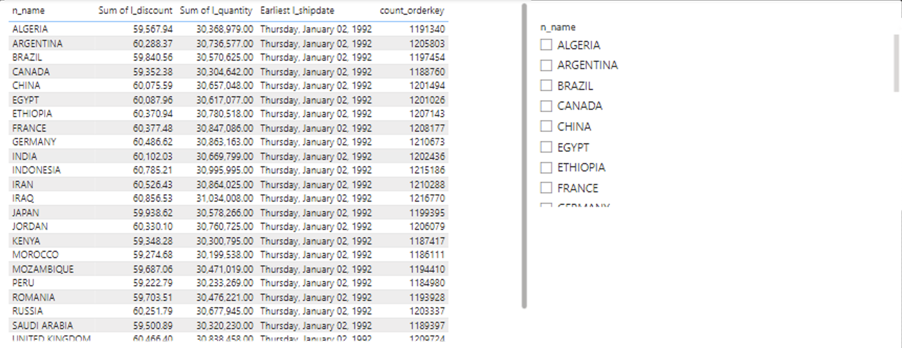
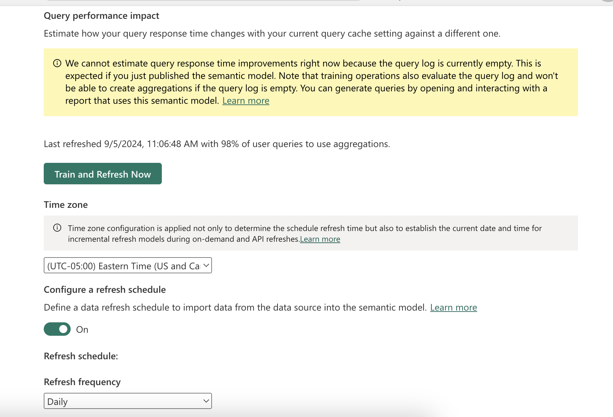

# Automatic Aggregation
## Introduction
[Automatic Aggregation](https://learn.microsoft.com/en-us/power-bi/enterprise/aggregations-auto) in Power BI use state-of-the-art machine learning (ML) to continuously optimize DirectQuery semantic models for maximum report query performance. Automatic aggregations are built on top of existing user-defined aggregations infrastructure first introduced with composite models for Power BI. In this example we will showcase how to enable Automatic Aggregation on Power Bi report and train Automatic Aggregation in order to speed up exploring report . You can follow the steps mentioned in the [Step by Step Instructions](#step-by-step-instructions) section.

## Pre-requisites

Before you begin, ensure you have the following:

- [Databricks account](https://databricks.com/), access to a Databricks workspace, and Databricks SQL Warehouse set up 
- [Power BI Desktop](https://powerbi.microsoft.com/desktop/) installed on your machine.
- Power BI **Premium** workspace
- DAX Studio](https://daxstudio.org/)

  
## Step by Step Instructions
1. We have an initial Power BI dataset which is based on **samples** catalog, **tpch** schema. All the dimension tables **customer** and **nation** are set up as Dual storage mode . The fact table  **orders** and **lineitem** are set to Direct Query mode. Below is the datamodel for the sample report

2. Created a simple tabular report showing the count of order and min shipment date  , sum of discounts and sum of quantities . Also there is slicer with nation names , as shown below

3. As seen below the quire hit the DBSQL warehouse . The query took 10.5 sec and read 38M records . 

4. Publish this report to a **Premium** workspace.
5. Enable the Automatic Aggregation in Power BI Service by opening the setting of the Semantic Model and enabling Automatic Aggregation Training . You can set the Query Coverage according to your needs. This setting will increase the Number of user queries analyzed and stored in cache. The higher % od Query Coverage will lead to more queries getting cached but will increase the Query Log refresh time . 

6. For Power BI to automatically create aggregates and populate the query log , Power BI needs to analyze the user queries. You can either open the deplopyed Power BI Report and interact with report by selecting different Nation Names in the slicer or you can open the DAX studio and run the sample DAX query mentioned  [here](./DAX/Dax_query) .
   
**Please note** for better trainig the model just change the nation names in the DAX query and run for different nations. 

7. You can train the model immediately or can also schedule refresh of the query log of model . 
   
8. Once the model is trained and query log cache is populated. The next time you inteact with the report the queries will be retrieved from cache and not from DBSQL . Hence you will see sub sec report performance as data is reteievd from cache , this improving the report perfromance. 

## Conclusion
When using **Direct Query** mode in Power BI, configuring Automatic Aggregation for large tables may significantly improve overall report  performance and unlike user-defined aggregations, automatic aggregations don’t require extensive data modeling and query-optimization skills to configure and maintain. Automatic aggregations are both self-training and self-optimizing

## Power BI Template 

A sample Power BI template [Automatic_Aggregate_Template.pbit](./Automatic_Aggregate_Template.pbit) is present in the current folder. When opening the template, enter respective **ServerHostname** and **HTTP Path** values of your Databricks SQL Warehouse. The template uses **samples** catalog, therefore you don't need to prepare any additional data for this report.

