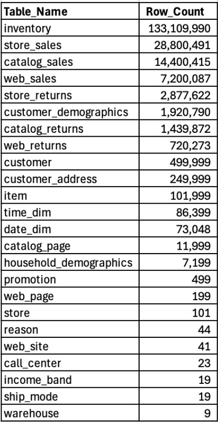
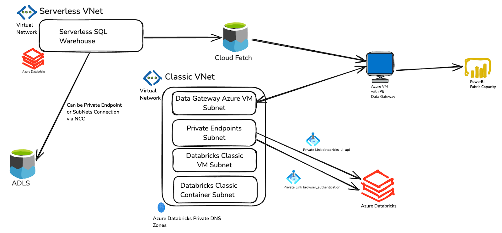
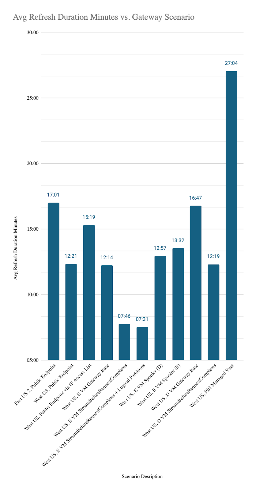

# Power BI connectivity via Gateways

## Overview
Power BI offers two primary methods for secure connections to an Azure Databricks workspace with Private Link:
1. [On-premises data gateway](https://learn.microsoft.com/en-us/data-integration/vnet/overview): An application that gets installed on a Virtual Machine that has a direct networking connection to a data source. It allows Power BI to connect to data sources that don’t allow public connections. The [general flow](https://learn.microsoft.com/en-us/azure/databricks/security/network/classic/private-link-standard#diagrams) of this setup entails: 
    1. Create or leverage a set of Private Endpoints to the Azure Databricks workspace - both sub-resources for databricks_ui_api and browser_authentication are required
    2. Create or leverage a Private DNS Zone for privatelink.azuredatabricks.net
    3. Deploy an Azure VM into a VNet/subnet
    4. The VM’s VNet/subnet should have access to the Private Endpoints (PEs) via either them being in the same VNet or being peered with another VNet where they reside
    5. [Install](https://learn.microsoft.com/en-us/data-integration/gateway/service-gateway-install) and [configure](https://learn.microsoft.com/en-us/data-integration/gateway/service-gateway-app) the on-premise data gateway software on the VM
    6. Create a [connection](https://learn.microsoft.com/en-us/power-bi/connect-data/service-gateway-data-sources) in the Power BI Service via Settings ->  Manage Connections and Gateways UIs
    7. [Configure](https://learn.microsoft.com/en-us/power-bi/connect-data/refresh-data#using-an-enterprise-data-gateway) the Semantic Model to use the connection under the Semantic Model’s settings and gateway and cloud connections sub-section
2. Virtual Network Data Gateway: A fully managed data gateway that gets created and managed by the Power BI service.  Connections work by allowing Power BI to delegate into a VNet for secure connectivity to the data source.  The general flow of this setup entails: 
    1. Create or leverage a set of Private Endpoints (PEs) to the Azure Databricks workspace - both sub-resources for databricks_ui_api and browser_authentication are required
    2. Create or leverage a Private DNS Zone for privatelink.azuredatabricks.net
    3. Create a subnet in a VNet that has access to the Private Endpoints (PEs) via either them being in the same VNet or being peered with another VNet where they reside.  Delegate the Subnet to Microsoft.PowerPlatform/vnetaccesslinks
    4. Create a virtual network data gateway in the Power BI Service via Settings -> Manage Connections and Gateways UIs
    5. [Configure](https://learn.microsoft.com/en-us/power-bi/connect-data/refresh-data#using-an-enterprise-data-gateway) the the Semantic Model to use the connection under the Semantic Model’s settings and gateway and cloud connections sub-section

The documentation for both options is fairly extensive, and this Repo will not focus on breaking down the configurations further.  Instead, this post is about configuring your private connections to get the best Import performance.

## On-Premise Data Gateway Performance Testing
In order to provide configuration guidance, a series of Power BI Import tests were performed using various configurations and a testing dataset.

### Testing Data
The testing dataset used was a TPC-DS scale factor 10 dataset (you can create your own using this [Repo](https://github.com/databricks/tpcds-kit)).  A scale factor of 10 in TPC-DS generates about 10 gigabytes (GB) of data.  The TPC-DS dataset was loaded into Unity Catalog and the [primary](../09.%20Private%20Connections/tpc-ds%20PKs.sql) and [foreign](../09.%20Private%20Connections/tpc-ds%20FKs.sql) keys were created between the tables.  A model was then created in the Power BI Service using the [Publish to Power BI](https://learn.microsoft.com/en-us/azure/databricks/partners/bi/power-bi#publish) capabilities in Unity Catalog; the primary and foreign keys were used to automatically create relationships between the tables in the Power BI semantic model.  Here’s an overview of the tables used in this dataset:

### Fabric Capacity
An F64 Fabric Capacity was used in the West US region.  The F64 was the [smallest size](https://learn.microsoft.com/en-us/power-bi/enterprise/service-premium-what-is#semantic-model-sku-limitation) available (in terms of RAM) for refreshing the model without getting capacity errors - the compressed Semantic Model size is 5,244 MB.

### Azure Databricks SQL Warehouse
An Azure Databricks workspace using Unity Catalog was deployed in the East US 2 and West US regions for the performance tests.  A [Medium Databricks SQL Warehouse](https://learn.microsoft.com/en-us/azure/databricks/compute/sql-warehouse/warehouse-behavior#serverless-sizing) was used.  For Imports, generally speaking, the size of the SQL Warehouse isn’t very important.  Using an aggressive [Auto Stop](https://learn.microsoft.com/en-us/azure/databricks/compute/sql-warehouse/create#configure-sql-warehouse-settings) configuration of 5 minutes is ideal to minimize compute charges (1 minute can be used if the SQL Warehouse is deployed via an API).

### Testing Architecture
The following diagram summarizes a simplified Azure networking architecture for the performance tests.

1. A Power BI Semantic Model is connected to a Power BI On-Premise Data Gateway Connection
2. The On-Premise Data Gateway Connection connects to the Azure Databricks workspace using Private Endpoints. 
3. Azure Databricks provisions up a Serverless SQL Warehouse in ~5 seconds within the Serverless Data Plane within Azure.  SQL queries are executed on the Serverless SQL Warehouse. 
4. Unity Catalog gives the Serverless SQL Warehouse a read-only, down-scoped, and pre-signed URL to ADLS. 
5. Data is fetched from ADLS and placed on the Azure Databricks workspace’s managed storage account via a capability called Cloud Fetch.
6. Arrow Files are pulled from [Cloud Fetch](https://www.databricks.com/blog/2021/08/11/how-we-achieved-high-bandwidth-connectivity-with-bi-tools.html) and delivered to the Power BI Service through the Data Gateway. 
7. Data in the Semanic Model is compressed and stored in Vertipaq In-Memory storage.

### Testing Results
The following grid outlines the scenarios tested and the results for each test.  We’ll review the different configurations tested below in specific sections.

|Scenario| Gateway Scenario | Avg Refresh Duration Minutes |
| ------ | ---------------- | ---------------------------- |
| A | East US 2, Public Endpoint | 17:01 |
| B | West US, Public Endpoint | 12:21 |
| C | West US, Public Endpoint via IP Access List | 15:19 |
| D | West US, E VM Gateway Base | 12:14 |
| E | West US, E VM StreamBeforeRequestCompletes | 07:46 |
| F | West US, E VM StreamBeforeRequestCompletes + Logical Partitions| 07:31 |
| G | West US, E VM Spooler (D) | 12:57 |
| H | West US, E VM Spooler (E) | 13:32 |
| I | West US, D VM Gateway Base | 16:47 |
| J | West US, D VM StreamBeforeRequestCompletes | 12:19 |
| K | West US, PBI Managed Vnet | 27:04| 

|Scenario| VM Configuration |
| ------ | ---------------- |
| D | Standard E8bds v5 (8 vcpus, 64 GiB memory) [NVMe, Accelerated Networking], C Drive default (Premium SSD LRS 127 GiB) | 
| E | Standard E8bds v5 (8 vcpus, 64 GiB memory) [NVMe, Accelerated Networking], C Drive default (Premium SSD LRS 127 GiB) | 
| F | Standard E8bds v5 (8 vcpus, 64 GiB memory) [NVMe, Accelerated Networking], C Drive default (Premium SSD LRS 127 GiB) | 
| G | Standard E8bds v5 (8 vcpus, 64 GiB memory) [NVMe, Accelerated Networking], D drive | 
| H | Standard E8bds v5 (8 vcpus, 64 GiB memory) [NVMe, Accelerated Networking], E Drive (Premium SSD LRS 600 GiB) | 
| I | Standard D8s v3 (8 vcpus, 32 GiB memory), C Drive default (Premium SSD LRS 127 GiB) | 
| J | Standard D8s v3 (8 vcpus, 32 GiB memory), C Drive default (Premium SSD LRS 127 GiB) | 

## On-premise Data Gateway Performance Configurations Analysis
### 1. Regional Alignment
Aligning your Power BI Premium/Fabric Capacity to the same region as your Azure Databricks deployment and your On-Premise Data Gateway VM helps reduce the overall network latency and data transfer duration. It should also eliminate cross-region networking charges. 

In scenario A, the Azure Databricks deployment was in East US 2 while the Fabric Capacity and On-Premise Data Gateway VM were in West US.  The Import processing time when using the public endpoint between the regions was 17:01 minutes.  In scenario B, while still using the public endpoint, there is complete regional alignment in the West US region and the Import times averaged 12:21 minutes which is a 27.4% decrease 

### 2. Configure a Gateway Cluster
A Power BI Data [Gateway Cluster](https://learn.microsoft.com/en-us/data-integration/gateway/service-gateway-high-availability-clusters) configuration is highly recommended for Prouduction deployments but this configuration was not performance tested during this experiment. Data Gateway clusters can help with data refresh redundancy and for overall volume / throughput of data transfer.  This configuration is highly recommended for Production Power BI environments.    

### 3. VM Family Selection
The Power BI documentation [recommends](https://learn.microsoft.com/en-us/data-integration/gateway/service-gateway-install#recommended) a VM with 8 cores, 8 GB of RAM, and an SSD for the VM used for the On-Premise Data Gateway.  Through testing, it can be proven that using a VM with good performance characteristics can provide immense value in the Import times.  

In scenario D, data gateway tests were run using a Standard E8bds v5 with 8 cores and 64 GB RAM that also included NVMe, and Accelerated Networking, and a C drive using a Premium SSD.    The import times for this scenario averaged 12:14 minutes which was slightly faster than the regionally aligned public endpoint test in scenario B.

In scenario I, data gateway tests were run using a Standard D8s v3 with 8 cores and 32 GB RAM and a C drive using a Premium SSD.  The import times for this scenario averaged 16:47 minutes which was noticeably slower than using the regionally aligned public endpoint in cenario B which was a 35.96% performance degradation.

More tests could certainly be done to determine which VM characteristics help the most with Import performance, but it is clear certain features can be helpful like:
* [Premium SSDs](https://learn.microsoft.com/en-us/azure/virtual-machines/disks-types#disk-type-comparison)
* [Accelerated Networking](https://learn.microsoft.com/en-us/azure/virtual-network/accelerated-networking-overview?tabs=redhat)
* [NVMe controller](https://learn.microsoft.com/en-us/azure/virtual-machines/nvme-overview)
* [Memory optimized instances](https://learn.microsoft.com/en-us/azure/virtual-machines/sizes/memory-optimized/e-family?tabs=epsv6%2Ceasv6%2Cev5%2Cedv5%2Ceasv5%2Cepsv5)

And while the better [E8bds v5](https://instances.vantage.sh/azure/vm/e8bds-v5) Azure VM costs ~$820 per month in West US at list and the [D8s v3](https://instances.vantage.sh/azure/vm/d8s-v3) costs ~$610 per month at list (25% more expensive), this feels like a scenario where you pay the premium to get better performance and optimize through Azure VM [reservations](https://learn.microsoft.com/en-us/azure/cost-management-billing/reservations/save-compute-costs-reservations).  

### 4. StreamBeforeRequestCompletes
By default, the on-premise data gateway spools data to disk before sending it to Power BI.  Enabling the [StreamBeforeRequestCompletes](https://learn.microsoft.com/en-us/data-integration/gateway/service-gateway-performance#optimize-performance-by-streaming-data) setting to True can significantly improve gateway refresh performance as it allows data to be streamed directly to the Power BI Service without first being spooled to disk.

In scenario E, when StreamBeforeRequestCompletes is set to True and restarted, you can see that the average Import times significantly improved to 07:46 minutes which is a 54% improvement compared to scenario A and a 36% improvement over the base VM configuration in scenario D.

### 5. Spooler Location 
As discussed above, when using the default setting for StreamBeforeRequestCompletes as False (the default), Power BI spools the data to the data gateway spool directory before sending it to the Power BI Service.  

In scenarios D, G, and H, StreamBeforeRequestCompletes is False and the [Spooler directory](https://learn.microsoft.com/en-us/data-integration/gateway/service-gateway-configure-disk-space#gateway-spooling-data) has been mapped to the C drive, D drive, and E drives respectively which all correspond to an SSD (of varying configuration) on the Azure VMs. 

In all scenarios, you can see the times are similar between 12:14, 12:57, and 13:32 minutes, respectively. In all three scenarios the tests were performed with SSDs on the E series VM configured with NVMe. Using this configuration mix, it doesn’t appear that the Spooler directory location provides significant performance improvements.  Since the C drive configuration gave the best performance it seems prudent to keep the C drive default configuration.  However, it is possible that that the Spooler directory setting might provide more value on a different VM configurations. 

### 6. Logical Partitioning
As outlined in the [QuickStart samples guide](https://github.com/yati1002/Power-BI-DatabricksSQL-QuickStart-Samples/tree/main/03.%20Logical%20Partitioning), logical partitioning can often help with Power BI Import performance as multiple logical partitions in the Semantic Model can be processed at the same time. 
 
In scenario F, logical partitions were created for the inventory and store_sales table to have 5 partitions each.  When combined with the StreamBeforeRequestCompletes setting, the benefit from adding Logical Partitions was negligible (15 second improvement) even though the parallelization settings were increased to 30 (Max Parallelism Per Refresh and Data Source Default Max Connections).  

While logical partitions are usually a very valuable strategy, combining them with StreamBeforeRequestCompletes, the E series VM configurations, and a Fabric F64 capacity yielded diminishing returns. It is probably worth more testing at some point in the future.

## Virtual Network Data Gateway Performance Testing
The configuration and performance of a Virtual Network Data Gateway was briefly tested (scenario K).  A Power BI subnet was created in the same VNet as the Azure Databricks workspace and delegated to the Power BI Service.  A virtual network data gateway was created in the UI with 2 gateways (12 queries can run in parallel) and assigned to the Semantic Model.  

In scenario K, an Import test was performed through the Virtual Network Data Gateway that took 27:04 minutes. More time was not spent trying to tune the Virtual Network Data Gateway as it was not the primary focus of this blog post.

## The Best Configuration: Region Alignment + Good VM + StreamBeforeRequestsCompletes
While the Import testing performed for this blog post isn’t definitive, it does provide good directional value in forming an opinion on how you can configure your Power BI On-Premise Data Gateway on an Azure Virtual Machine to get good performance. 

When looking at the tests performed for this blog, an Azure Virtual Machine, in the same region as the Azure Databricks Workspace and the Fabric Capacity, with Accelerated networking, an SSD, NVMe, and memory optimized compute provided performance that was faster than just using the public endpoint of the Azure Databricks Workspace alone.  Using this configuration, we improved our Import performance from 17:01 to 07:46 minutes which is a 54% performance improvement.