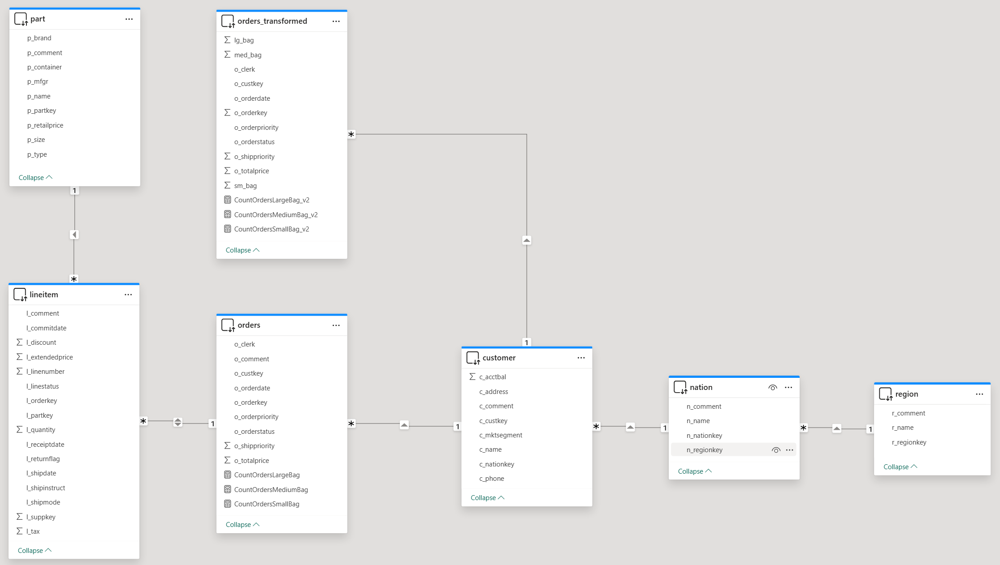
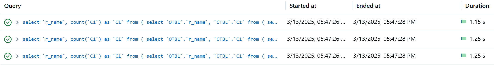
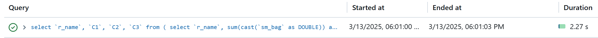

# Pushdown Calculations

## Introduction

When working with Power BI on Databricks Lakehouse, reports built using DirectQuery mode can analyze hundreds of gigabytes - or even terabytes - of data. While Databricks SQL engine delivers excellent single-query performance, user experience can suffer if a report triggers many SQL queries at once. Building efficient semantic models in Power BI is essential to ensure responsive analytics and optimal resource usage, making the most of both Databricks SQL and Power BI features. Even simple DAX measures may sometimes result in multiple SQL queries being executed.

This quickstart demonstrates a data modeling approach that can, in certain scenarios, help minimize the number of SQL queries generated. By following these techniques, you’ll be able to achieve faster performance and a smoother end-user experience.


## Prerequisites

Before you begin, ensure you have the following:

- [Databricks account](https://databricks.com/), access to a Databricks workspace, Unity Catalog, and SQL Warehouse
- [Power BI Desktop](https://powerbi.microsoft.com/desktop/), latest version is highly recommended


  
## Step by step walkthrough

1. Create a catalog and a schema in Databricks Unity Catalog.
    ```sql
    CREATE CATALOG IF NOT EXISTS powerbiquickstarts;
    USE CATALOG powerbiquickstarts;
    CREATE SCHEMA IF NOT EXISTS tpch;
    USE SCHEMA tpch;
    ```

2. Create a table in the catalog by replicating tables from **`samples`** catalog.
    ```sql
    CREATE OR REPLACE TABLE region AS SELECT * FROM samples.tpch.region;
    CREATE OR REPLACE TABLE nation AS SELECT * FROM samples.tpch.nation;
    CREATE OR REPLACE TABLE customer AS SELECT * FROM samples.tpch.customer;
    CREATE OR REPLACE TABLE part AS SELECT * FROM samples.tpch.part;
    CREATE OR REPLACE TABLE orders AS SELECT * FROM samples.tpch.orders;
    CREATE OR REPLACE TABLE lineitem AS SELECT * FROM samples.tpch.lineitem;
    ```

3. Connect to Databricks SQL Warehouse, **`powerbiquickstarts`** catalog, **`tpch`** schema, and add the following tables/views to the semantic model. All tables should be set to **DirectQuery** storage mode.
    - `region`
    - `nation`
    - `part`
    - `customer`
    - `orders`
    - `orders_transformed`
    - `lineitem`
    
4. Create table relationships as shown on the picture below.
    

5. In **`orders`** table create 3 calculated measures using the following DAX-formulas. These measures calculate the number of orders where an order item is delivered in Large, Medium, or Small bag.
    ```
    CountOrdersLargeBag = CALCULATE(COUNT(orders[o_orderkey]), 'part'[p_container]="LG BAG")
    CountOrdersMediumBag = CALCULATE(COUNT(orders[o_orderkey]), 'part'[p_container]="MED BAG")
    CountOrdersSmallBag = CALCULATE(COUNT(orders[o_orderkey]), 'part'[p_container]="SM BAG")
    ```
    
6. Create a table visual and add **`region.r_name`** column, as well as prevously created measures **`CountOrdersLargeBag`**, **`CountOrdersMediumBag`**, and **`CountOrdersSmallBag`**. Turn off Totals for the table visual.
    

7. Refresh visuals using [Performance Analyzer](https://learn.microsoft.com/en-us/power-bi/create-reports/desktop-performance-analyzer) in Power BI Desktop.

8. Check the number of SQL-queries in Databricks Query History. You should see 3 SQL-queries, each calculating one of the measures used in the table visual.

     

> [!IMPORTANT]
>  The reason why Power BI generated 3 SQL-queries is that the measures use related table **`part`** to filter data. Therefore, Power BI is not able to combine these 3 queries into a single one.

9. Next we will be using **`orders_transformed`** view which for every order item identifies the type of bag.  
    ``` sql
    CREATE OR REPLACE VIEW orders_transformed AS
    SELECT o_orderkey, o_custkey, o_orderstatus, o_totalprice, o_orderdate, o_orderpriority, o_clerk, o_shippriority
        , max(if(p_container='SM BAG', 1, 0)) AS sm_bag
        , max(if(p_container='MED BAG', 1, 0)) AS med_bag
        , max(if(p_container='LG BAG', 1, 0)) AS lg_bag
    FROM orders
        JOIN lineitem on o_orderkey=l_orderkey
        JOIN part on l_partkey=p_partkey
    GROUP BY ALL;
    ```

10. In Power BI semantic model in **`orders_transformed`** table create 3 calculated measures using the following DAX-formulas. These measures produce the same results as original measures.
    ```
    CountOrdersLargeBag_v2 = SUM(orders_transformed[lg_bag])
    CountOrdersMediumBag_v2 = SUM(orders_transformed[med_bag])
    CountOrdersSmallBag_v2 = SUM(orders_transformed[sm_bag])
    ```

11. Create a new report page, add a table visual, and add **`region.r_name`** column, as well as prevously created measures **`CountOrdersLargeBag_v2`**, **`CountOrdersMediumBag_v2`**, and **`CountOrdersSmallBag_v2`**. Turn off Totals for the table visual.
     

12. Refresh visuals using [Performance Analyzer](https://learn.microsoft.com/en-us/power-bi/create-reports/desktop-performance-analyzer) in Power BI Desktop.

13. Check the number of SQL-queries in Databricks Query History. You should see only 1 SQL-queries.
    

> [!IMPORTANT]
> The reason why Power BI generated only 1 SQL-queries in this case is that the measures use SUM aggregation function over columns in the same table **`orders_transformed`**. Therefore, Power BI could use as single SQL-query.


14. Clean up your environment by dropping the catalog.
    ```sql
    DROP CATALOG IF EXISTS powerbiquickstarts CASCADE;
    ```


## Conclusion

By pushing calculations - or portions of them - down to the Databricks SQL data source, this approach significantly reduces the number of SQL queries generated by Power BI, resulting in much faster performance and a smoother end-user experience. This optimization technique not only enhances query responsiveness but also lowers the overall workload on both Databricks SQL and Power BI, allowing organizations to serve more users efficiently while reducing infrastructure and operational costs


## Power BI template

A Power BI template [Pushdown Calculations.pbit](./Pushdown%20Calculations.pbit) and [Pushdown Calculations.sql](./Pushdown%20Calculations.sql) script are provided in this folder to demonstrate the approach of pushing down calculations outlined above. To use the template, simply enter your Databricks SQL Warehouse's **`ServerHostname`** and **`HttpPath`**, along with the **`Catalog`** and **`Schema`** names that correspond to the environment set up in the instructions above.
