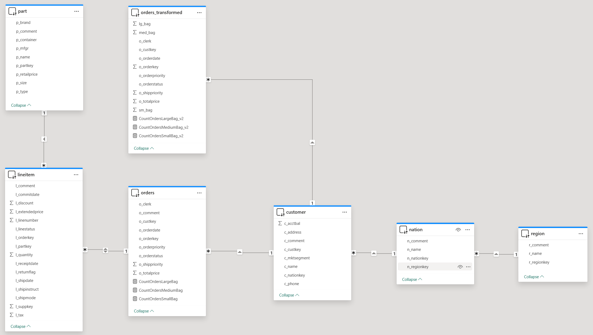
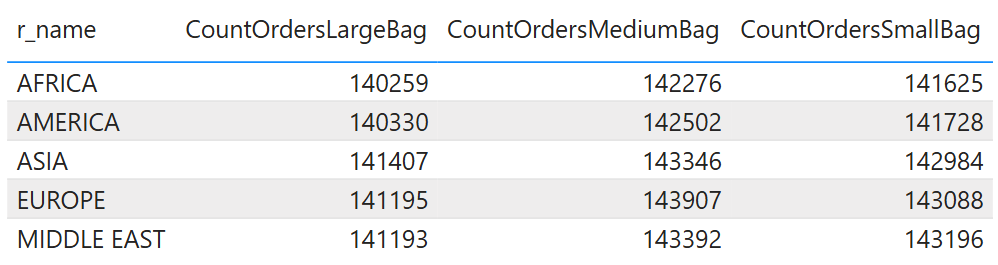
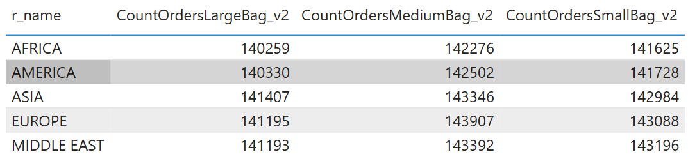
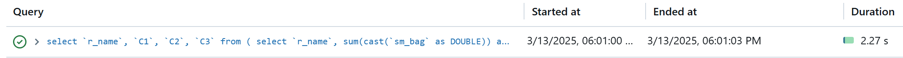

# Pushdown Transformations

## Introduction
When using Power BI on top of Databrics Lakehouse, Power BI developers can build reports which consume hundreds gigabytes or even terabytes of data using DirectQuery mode. Though Databricks SQL engine provides superb performance for individual queries, end user experience may be impacted if a report generates multiple SQL-queries. That is it's important to build efficient semantic models in Power BI by leveraging both Databricks SQL and Power BI capabilities wisely. For example, even relatively simple DAX-measures may result in generating multiple SQL-queries. 

In the present quickstart sample we discuss a data modeling technique which in certain cases helps generate fewer SQL-queries, hence achieving overall better performance and user experience.

## Pre-requisites

Before you begin, ensure you have the following:

- [Databricks account](https://databricks.com/), access to a Databricks workspace, and Databricks SQL Warehouse. 
- [Power BI Desktop](https://powerbi.microsoft.com/desktop/) installed on your machine. Latest version is highly recommended.


  
## Step by Step Instructions
1. Copy-paste the code from [Pushdown Transformations.sql](./Pushdown%20Transformations.sql) SQL-script to Databricks SQL Editor and execute the script to create the objects required for this example. This includes **powerbisamples** catalog, **tpch** schema, as well as tables and a view.
2. Open Power BI Desktop, create a new report.
3. Connect to Databricks SQL Warehouse, **powerbisamples** catalog, **tpch** schema, and add the following tables/views from  to the semantic model
    - region
    - nation
    - part
    - customer
    - orders
    - orders_transformed
    - lineitem
4. Configure table relationships as shown on the picture below.

5. In **orders** table create 3 calculated measures using the following DAX-formulas. These measures calculate the number of orders where an order item is delivered in Large, Medium, or Small bag.
    ```
    CountOrdersLargeBag = CALCULATE(COUNT(orders[o_orderkey]), 'part'[p_container]="LG BAG")
    CountOrdersMediumBag = CALCULATE(COUNT(orders[o_orderkey]), 'part'[p_container]="MED BAG")
    CountOrdersSmallBag = CALCULATE(COUNT(orders[o_orderkey]), 'part'[p_container]="SM BAG")
    ```
6. Create a table visual and add **region.r_name** column, as well as prevously created measures **CountOrdersLargeBag**, **CountOrdersMediumBag**, and **CountOrdersSmallBag**. Turn off Totals for the table visual.

7. Refresh visuals using [Performance Analyzer](https://learn.microsoft.com/en-us/power-bi/create-reports/desktop-performance-analyzer) in Power BI Desktop.
8. Check the number of SQL-queries in Databricks Query History. You should see 3 SQL-queries, each calculating one of the measures used in the table visual.
 
The reason why Power BI generated 3 SQL-queries is that the measures use related table **part** to filter data. Therefore, Power BI is not able to combine these 3 queries into a single one.

9. Next we will be using **orders_transformed** view which for every order item identifies the type of bag.  
    ``` sql
    create or replace view powerbisamples.tpch.orders_transformed as
    select o_orderkey, o_custkey, o_orderstatus, o_totalprice, o_orderdate, o_orderpriority, o_clerk, o_shippriority
        , max(if(p_container='SM BAG', 1, 0)) as sm_bag
        , max(if(p_container='MED BAG', 1, 0)) as med_bag
        , max(if(p_container='LG BAG', 1, 0)) as lg_bag
    from powerbisamples.tpch.orders
        join powerbisamples.tpch.lineitem on o_orderkey=l_orderkey
        join powerbisamples.tpch.part on l_partkey=p_partkey
    group by all;
    ```

10. In Power BI semantic model in **orders_transformed** table create 3 calculated measures using the following DAX-formulas. These measures produce the same results as original measures.
    ```
    CountOrdersLargeBag_v2 = SUM(orders_transformed[lg_bag])
    CountOrdersMediumBag_v2 = SUM(orders_transformed[med_bag])
    CountOrdersSmallBag_v2 = SUM(orders_transformed[sm_bag])
    ```
11. Create a table visual and add **region.r_name** column, as well as prevously created measures **CountOrdersLargeBag_v2**, **CountOrdersMediumBag_v2**, and **CountOrdersSmallBag_v2**. Turn off Totals for the table visual.

12. Refresh visuals using [Performance Analyzer](https://learn.microsoft.com/en-us/power-bi/create-reports/desktop-performance-analyzer) in Power BI Desktop.

13. Check the number of SQL-queries in Databricks Query History. You should see only 1 SQL-queries.
 
The reason why Power BI generated only 1 SQL-queries in this case is that the measures use SUM aggregation function over columns in the same table **orders_transformed**. Therefore, Power BI could use as single SQL-query.


## Conclusion
As we saw in this example, by explicitly pushing calculations (or some part of them) down to the data source, i.e. Databricks SQL, it is possible to significantly decrease the number of SQL-queries generated by Power BI, hence enabling much better performance and end user experience. Such technique allows decrease overall workload both on Databricks SQL and Power BI, thus serving more users at lower cost.

## Power BI Template 

A sample Power BI template [Pushdown Transformations.pbit](./Pushdown%20Transformations.pbit) is present in the current folder. When opening the template, enter respective **ServerHostname** and **HTTP Path** values of your Databricks SQL Warehouse as well as the name of **Catalog** (default *powerbisamples*) and **Schema** (default *tpch*).

