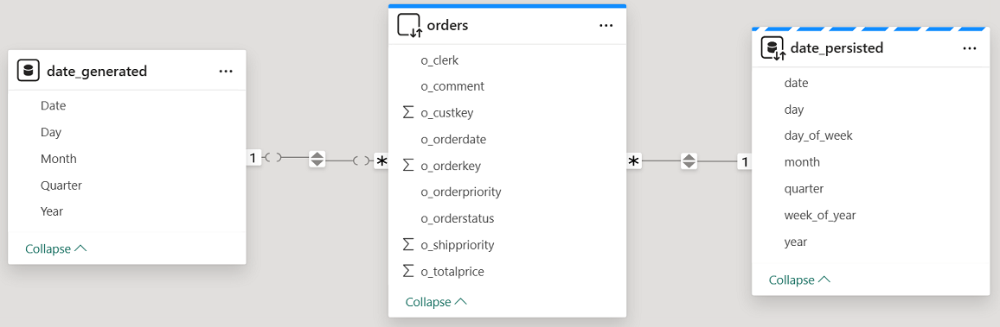
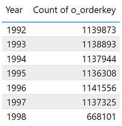
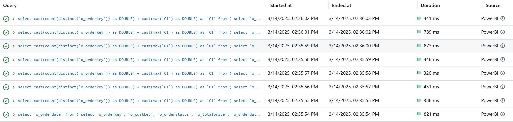
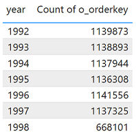
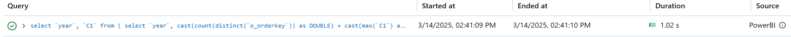

# Generated vs Persisted dimension

## Introduction

Dimensions are fundamental to effective data modeling. When working with reference dimensions like the Date dimension, Power BI developers can choose between creating DAX-generated tables (*Generated dimensions*) or leveraging persisted tables (*Persisted dimensions*) stored in the data source, such as a Delta table in Databricks Unity Catalog. The way Power BI interacts with these dimension types can significantly impact report performance and user experience, making it essential to pick the right strategy.

In this quickstart, we'll highlight the advantages of using a *Persisted dimension* over a *Generated dimension*, focusing on the Date dimension as a practical example. Leveraging a persisted dimension can reduce the number of SQL queries generated - especially when working with *DirectQuery* or *Composite models* - leading to improved performance and a smoother experience for your end users.


## Prerequisites

Before you begin, ensure you have the following:

- [Databricks account](https://databricks.com/), access to a Databricks workspace, Unity Catalog, and SQL Warehouse
- [Power BI Desktop](https://powerbi.microsoft.com/desktop/), latest version is highly recommended


  
## Step by step walkthrough

1. Create a catalog and a schema in Databricks Unity Catalog.
    ```sql
    CREATE CATALOG IF NOT EXISTS powerbiquickstarts;
    USE CATALOG powerbiquickstarts;
    CREATE SCHEMA IF NOT EXISTS tpch;
    USE SCHEMA tpch;
    ```

2. Create test tables in the catalog by replicating tables from **`samples`** catalog.
    ```sql
    CREATE OR REPLACE TABLE orders as SELECT * FROM samples.tpch.orders;

    CREATE OR REPLACE TABLE dim_date as
    SELECT DISTINCT
    o_orderdate as date,
    year(o_orderdate) as year,
    month(o_orderdate) as month,
    day(o_orderdate) as day,
    dayofweek(o_orderdate) as day_of_week,
    weekofyear(o_orderdate) as week_of_year,
    quarter(o_orderdate) as quarter
    FROM orders;
    ```

3. Open Power BI Desktop, create a new report.
   
4. Connect to Databricks SQL Warehouse, **`powerbiquickstarts`** catalog, **`tpch`** schema, and add the following tables to the semantic model
    - **`orders`** → _DirectQuery_. 
    - **`dim_date`** → _Dual_ mode. Rename the table to **`date_persisted`**.
      
5. Create a calculated **`date_generated`** table by using the below DAX-formula. This generated table contains the dates based on minimum and maximum **`o_orderdate`** values in **`orders`** table
    ```
    date_generated = 
    VAR StartDate = CALCULATE(MIN('orders'[o_orderdate]))
    VAR EndDate = CALCULATE(MAX('orders'[o_orderdate]))
    RETURN 
        ADDCOLUMNS(
            CALENDAR(StartDate,EndDate)
            , "Year", YEAR([Date])
            , "Month", MONTH([Date])
            , "Day", DAY([Date])
            , "Quarter", QUARTER([Date])
        )
    ```

6. Create table relationships as shown on the picture below.
    

7. Create a table visual and add **`Year`** column from **`date_generated`** table, as well as **`Count of o_orderkey`**. Turn off Totals for the table visual.

    

8. Refresh visuals using [Performance Analyzer](https://learn.microsoft.com/en-us/power-bi/create-reports/desktop-performance-analyzer) in Power BI Desktop.
   
9. Check the number of SQL-queries in Databricks Query History. You should see 8 SQL-queries, 1 SQL-query to retrieve records for **date_generated** table and 7 SQL-queries to calculate counts of orders per year.
    

10. Next create a table visual and add **`year`** column from **`date_persisted`** table, as well as **`Count of o_orderkey`**. Turn off Totals for the table visual.

    

11. Refresh visuals using [Performance Analyzer](https://learn.microsoft.com/en-us/power-bi/create-reports/desktop-performance-analyzer) in Power BI Desktop.
    
12. Check the number of SQL-queries in Databricks Query History. You should see only 1 SQL-query to retrieve counts of orders for all years at once. As **`date_persisted`** table is set to _Dual_ mode, data for this table is cached in memory.

    


## Conclusion

Persisting dimension tables in the data source, such as Delta tables in Unity Catalog, and configuring them with _Dual_ storage mode in Power BI, reduces the number of SQL queries Power BI generates when using _DirectQuery_ or _Composite models_, leading to significantly improved performance and a more responsive end-user experience. This approach lowers the workload on both Databricks SQL and Power BI, enabling organizations to serve more users efficiently while costs down.


## Power BI Template 

A Power BI template [Generate vs Persisted dimension.pbit](./Generated%20vs%20Persisted%20dimension.pbit) and [Generate vs Persisted dimension.sql](./Generated%20vs%20Persisted%20dimension.sql) script are provided in this folder to demonstrate the approach of using persisted dimensions outlined above. To use the template, simply enter your Databricks SQL Warehouse's **`ServerHostname`** and **`HttpPath`**, along with the **`Catalog`** and **`Schema`** names that correspond to the environment set up in the instructions above.
