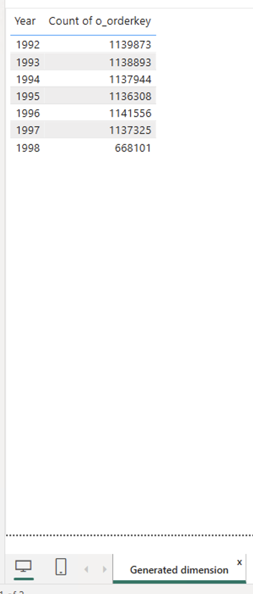
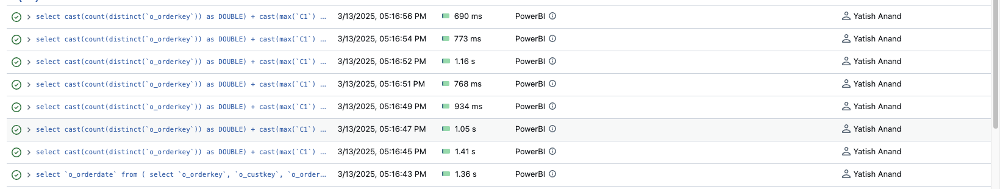
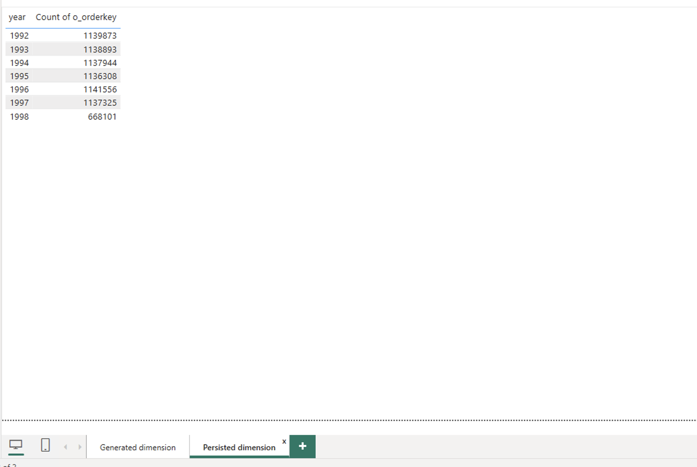
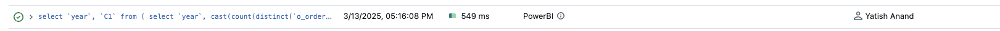

# Generated vs Persisted dimension
## Introduction
Dimensions play a very big role in data modelling . In Power BI you can either use DAX within PowerBI to Generate dimension table or you can Persist dimension in the source system . Carefully selecting the method to generate these dimensions are really important because report latency and end user experience may be impacted if a report generates multiple SQL-queries. Hence it's important to build efficient semantic models in Power BI by leveraging both Databricks SQL and Power BI capabilities wisely. 
In the present quickstart sample we will showcase the benefits of Persisted dimension over Generated dimension by using example of date dimension . Persisted dimension helps generate fewer SQL-queries, hence achieving overall better performance and user experience.


## Pre-requisites

Before you begin, ensure you have the following:

- [Databricks account](https://databricks.com/), access to a Databricks workspace, and Databricks SQL Warehouse. 
- [Power BI Desktop](https://powerbi.microsoft.com/desktop/) installed on your machine. Latest version is highly recommended.


  
## Step by Step Instructions
1. Copy-paste the code from [GeneratedvsPersisted.sql](./Generated%20vs%20Persisted%20dimension.sql) SQL-script to Databricks SQL Editor and execute the script to create the objects required for this example. This includes **powerbisamples** catalog, **tpch** schema, as well as tables.
2. Open Power BI Desktop, create a new report.
3. Connect to Databricks SQL Warehouse, **powerbisamples** catalog, **tpch** schema, and add the following tables from  to the semantic model
    - orders -> Direct Query 
    - dim_date -> Dual Mode. Rename the table as **date_persisted** in Power BI 
4. Create a Generated date dimension table (**date_generated**) from **orders** table by running the below DAX. This geenrated table contains the dates based on Min and Max Orderdate,
  ```
    date_generated = 
VAR StartDate = CALCULATE(MIN('orders'[o_orderdate]))
VAR EndDate = CALCULATE(MAX('orders'[o_orderdate]))
RETURN 
    ADDCOLUMNS(
        CALENDAR(StartDate,EndDate)
        , "Year", YEAR([Date])
        , "Month", MONTH([Date])
        , "Day", DAY([Date])
        , "Quarter", QUARTER([Date])
    )
 ```
5. Configure table relationships as shown on the picture below.

6. Create a table visual and add **date_generated.Year** column, as well as **CountofOrderkeys**. Turn off Totals for the table visual.

7. Refresh visuals using [Performance Analyzer](https://learn.microsoft.com/en-us/power-bi/create-reports/desktop-performance-analyzer) in Power BI Desktop.
8. Check the number of SQL-queries in Databricks Query History. You should see 8 SQL-queries, 1-sql query to retrieve records for **date_generated** table and 7 SQL-queries to calculate disctinct count of order per year
 
9. Next create a table visual and add **date_persisted.year** column, as well as **CountofOrderkeys**. Turn off Totals for the table visual.

10. Refresh visuals using [Performance Analyzer](https://learn.microsoft.com/en-us/power-bi/create-reports/desktop-performance-analyzer) in Power BI Desktop.
11. Check the number of SQL-queries in Databricks Query History. You should see only 1 SQL-queries to retrieve distinct count of orders for all years at once. As **date_persisted** is set to Dual mode , data is cached in memory 
 


## Conclusion
As we saw in this example, by explicitly persisting dimension in data source, i.e. Databricks SQL and setting it to Dual mode, it is possible to significantly decrease the number of SQL-queries generated by Power BI, hence enabling much better performance and end user experience. Such technique allows decrease overall workload both on Databricks SQL and Power BI, thus serving more users at lower cost.

## Power BI Template 

A sample Power BI template [Generate vs Persisted dimension.pbit](./Generated%20vs%20Persisted%20dimension.pbit) is present in the current folder. When opening the template, enter respective **ServerHostname** and **HTTP Path** values of your Databricks SQL Warehouse. The template uses **samples** catalog, therefore you don't need to prepare any additional data for this report.

