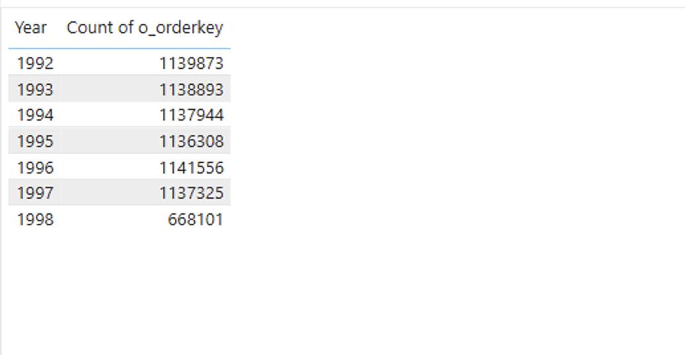
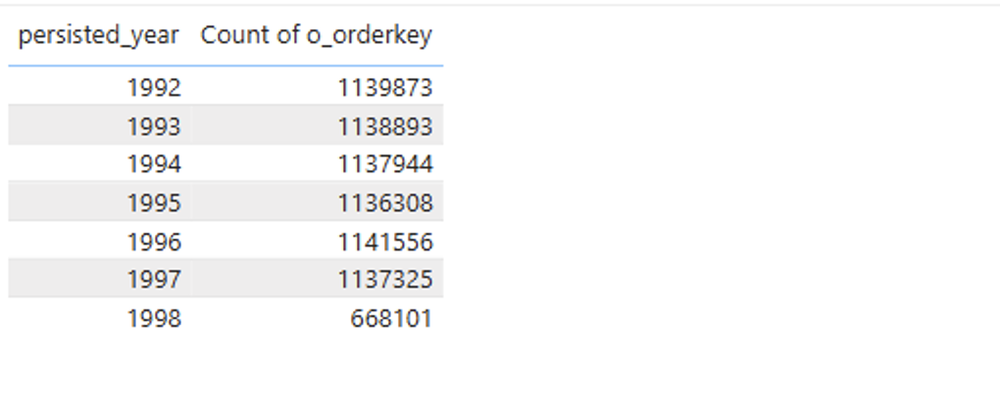

# Generated vs Persisted dimension
## Introduction
Dimensions play a crucial role in data modelling. For reference dimensions such as Date dimension, in Power BI you can either use either DAX-generated tables (*Generated dimension*) or you can use a persisted tables (*Persisted dimension*) in the data source, e.g. Delta-table in Databricks Unity Catalog. As the behavior of Power BI when using these two types of dimensions differs, choosing the right approach is crucial to achieve the best performance and end user experience. 

In the present quickstart sample we will showcase the benefits of Persisted dimension over Generated dimension by using example of **Date** dimension. Persisted dimension helps generate fewer SQL-queries, hence achieving overall better performance and user experience.


## Pre-requisites

Before you begin, ensure you have the following:

- [Databricks account](https://databricks.com/), access to a Databricks workspace, and Databricks SQL Warehouse. 
- [Power BI Desktop](https://powerbi.microsoft.com/desktop/) installed on your machine. Latest version is highly recommended.

  
## Step by Step Instructions
1. Copy-paste the code from [Generated vs Persisted.sql](./Generated%20vs%20Persisted%20dimension.sql) SQL-script to Databricks SQL Editor and execute the script to create the objects required for this example. This includes **powerbisamples** catalog, **tpch** schema, as well as tables and views.
   
2. Open Power BI Desktop, create a new report.
   
3. Connect to Databricks SQL Warehouse, **powerbisamples** catalog, **tpch** schema, and add the following tables to the semantic model
    - **orders** → Direct Query 
    - **dim_date** → Dual Mode. Rename the table to **date_persisted**.
      
4. Create a calculated **date_generated** table by using the below DAX-formula. This geenrated table contains the dates based on minimum and maximum o_orderdate values in **orders** table
    ```
    date_generated = 
    VAR StartDate = CALCULATE(MIN('orders'[o_orderdate]))
    VAR EndDate = CALCULATE(MAX('orders'[o_orderdate]))
    RETURN 
        ADDCOLUMNS(
            CALENDAR(StartDate,EndDate)
            , "Year", YEAR([Date])
            , "Month", MONTH([Date])
            , "Day", DAY([Date])
            , "Quarter", QUARTER([Date])
        )
    ```

5. Configure table relationships as shown on the picture below.


6. Create a table visual and add **Year** column from **date_generated** table, as well as **Count of o_orderkey**. Turn off Totals for the table visual.
    
    

7. Refresh visuals using [Performance Analyzer](https://learn.microsoft.com/en-us/power-bi/create-reports/desktop-performance-analyzer) in Power BI Desktop.
   
8. Check the number of SQL-queries in Databricks Query History. You should see 8 SQL-queries, 1 SQL-query to retrieve records for **date_generated** table and 7 SQL-queries to calculate counts of orders per year.

    

9. Next create a table visual and add **year** column from **date_persisted** table, as well as **Count of o_orderkeys**. Turn off Totals for the table visual.

    

10. Refresh visuals using [Performance Analyzer](https://learn.microsoft.com/en-us/power-bi/create-reports/desktop-performance-analyzer) in Power BI Desktop.
    
11. Check the number of SQL-queries in Databricks Query History. You should see only 1 SQL-query to retrieve counts of orders for all years at once. As **date_persisted** table is set to Dual mode, data for this table is cached in memory.

     


## Conclusion
As we saw in this example, by using a dimension table persisted in data source, i.e. Delta-table in Unity Catalog, and setting it to **Dual** storage mode, we achieved much better performance and end user experience by decreasing the number of SQL-queries generated by Power BI. Such technique allows decrease overall workload both on Databricks SQL and Power BI, thus serving more users at lower cost.

## Power BI Template 

A sample Power BI template [Generate vs Persisted dimension.pbit](./Generated%20vs%20Persisted%20dimension.pbit) is present in the current folder. When opening the template, enter respective **ServerHostname** and **HTTP Path** values of your Databricks SQL Warehouse. The template uses **samples** catalog as well as the name of **Catalog** (default *powerbisamples*) and **Schema** (default *tpch*).
