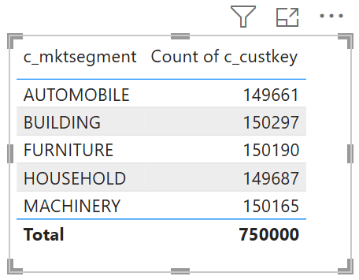
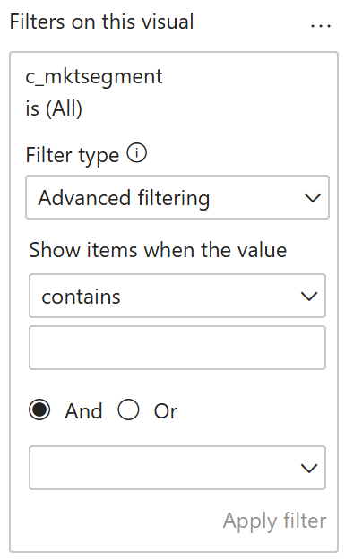
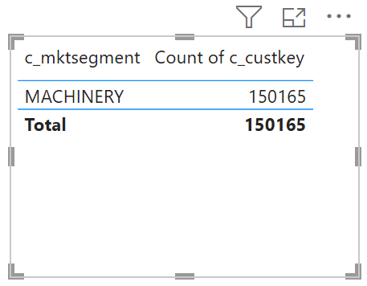

# Collations

## Introduction

Filtering data is a core part of working with BI tools like Power BI. While basic options such as drop-downs and slicers are common, many users prefer the flexibility of applying custom string filters to refine their results. Historically, Databricks users faced challenges when trying to implement case-insensitive filters. The Databricks SQL engine treated strings like ```ABC``` and ```abc``` as different values. This meant users had to enter filter criteria with exact casing, or developers resorted to extra workarounds - like generating lower-case columns for comparison - to enable flexible filtering. This quickstart demonstrates how to leverage [Collations](https://docs.databricks.com/aws/en/sql/language-manual/sql-ref-collation) within Databricks to easily implement case-insensitive data filtering in Power BI. With collations, you can simplify your filtering logic and provide a smoother experience for your users.


## Prerequisites

Before you begin, ensure you have the following:

- [Databricks account](https://databricks.com/), access to a Databricks workspace, Unity Catalog, and SQL Warehouse
- [Power BI Desktop](https://powerbi.microsoft.com/desktop/), latest version is highly recommended


  
## Step by step walkthrough

1. Create a catalog and a schema in Databricks Unity Catalog.
    ```sql
    CREATE CATALOG IF NOT EXISTS powerbiquickstarts;
    USE CATALOG powerbiquickstarts;
    CREATE SCHEMA IF NOT EXISTS tpch;
    USE SCHEMA tpch;
    ```

2. Create a table in the catalog by replicating tables from **`samples`** catalog.
    ```sql
    CREATE OR REPLACE TABLE table customer_lcase (
        c_custkey bigint,
        c_name string,
        c_address string,
        c_nationkey string,
        c_phone string,
        c_acctbal decimal(18,2),
        c_mktsegment string COLLATE UTF8_LCASE,
        c_comment string);

    INSERT INTO customer_lcase
    SELECT * FROM samples.tpch.customer;
    ```
   
3. Open Power BI Desktop, create a new report.
   
4. Connect to Databricks SQL Warehouse, **`powerbisamples`** catalog, **`tpch`** schema, and add the following tables to the semantic model
    - **`customer_lcase`** → DirectQuery.
      
4. Create a table visual, add **`c_mktsegment`** and **`c_custkey`** columns, configure the latter to use Count aggregation.
    
    

7. Add **`c_mktsegment`** column to Filters, configure it to use Advanced filtering and *contains* filter. 
   
    

8. Specify value ```MACH``` (upper case) and Apply filter.

    

8. Specify value ```mach``` (lower case) and Apply filter.

    

10. Clean up your environment by dropping the catalog.
    ```sql
    DROP CATALOG IF EXISTS powerbiquickstarts CASCADE;
    ```


## Conclusion

Using collations in Databricks for case-insensitive filtering in Power BI greatly simplifies queries by removing the need for manual upper or lower case conversions, making filter expressions cleaner and more intuitive. This feature provides consistent, user-friendly filtering regardless of casing (so ```MACH``` and ```mach``` match seamlessly) and significantly improves performance - case-insensitive comparisons using collations can be significantly faster than traditional string transformations. Collations also enhance portability when migrating from other systems and support language-specific filtering needs, streamlining both development and user experience.

For more information about Collations, including locales and case and accent modifiers, please refer to Databricks documentation - [Collations](https://docs.databricks.com/aws/en/sql/language-manual/sql-ref-collation).


## Power BI template

A Power BI template [Collations.pbit](./Collations.pbit) and [Collations.sql](./Collations.sql) script are  provided in this folder to demonstrate the usage of Collations outlined above. To use the template, simply enter your Databricks SQL Warehouse's **`ServerHostname`** and **`HttpPath`**, along with the **`Catalog`** and **`Schema`** names that correspond to the environment set up in the instructions above.